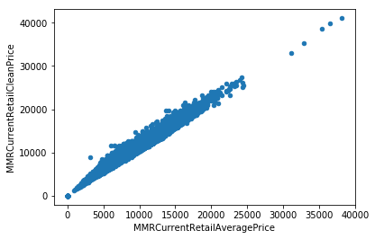
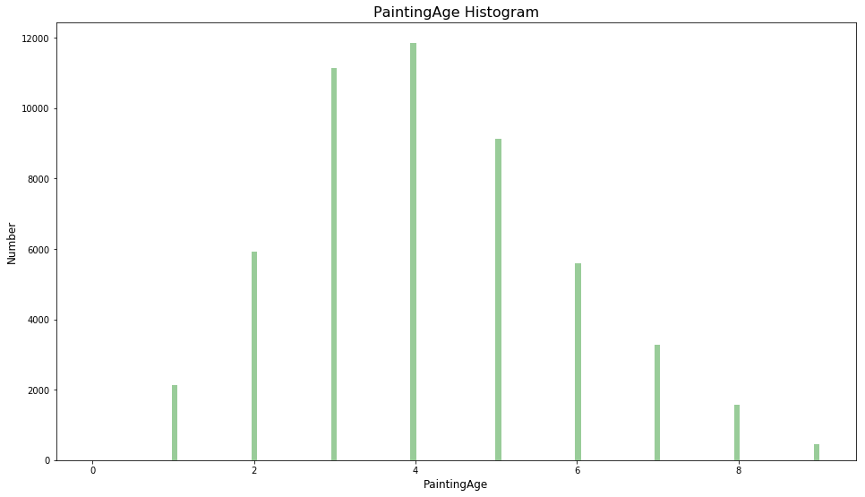
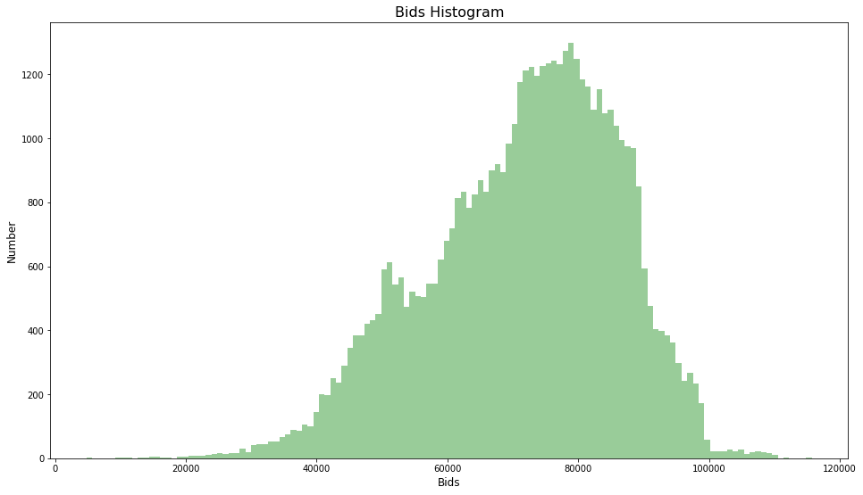
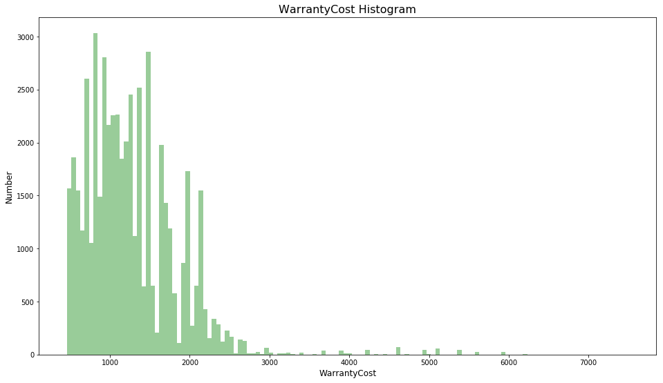
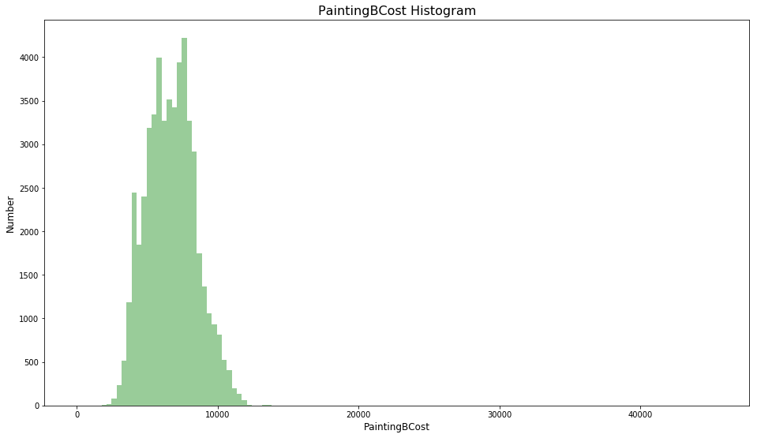
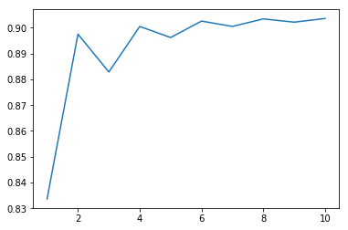
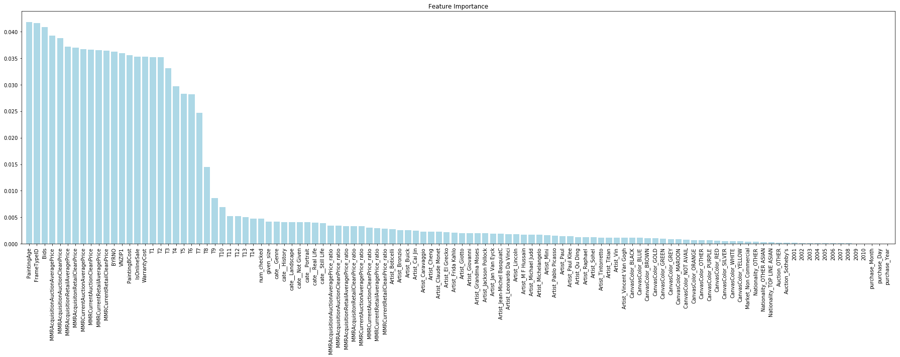
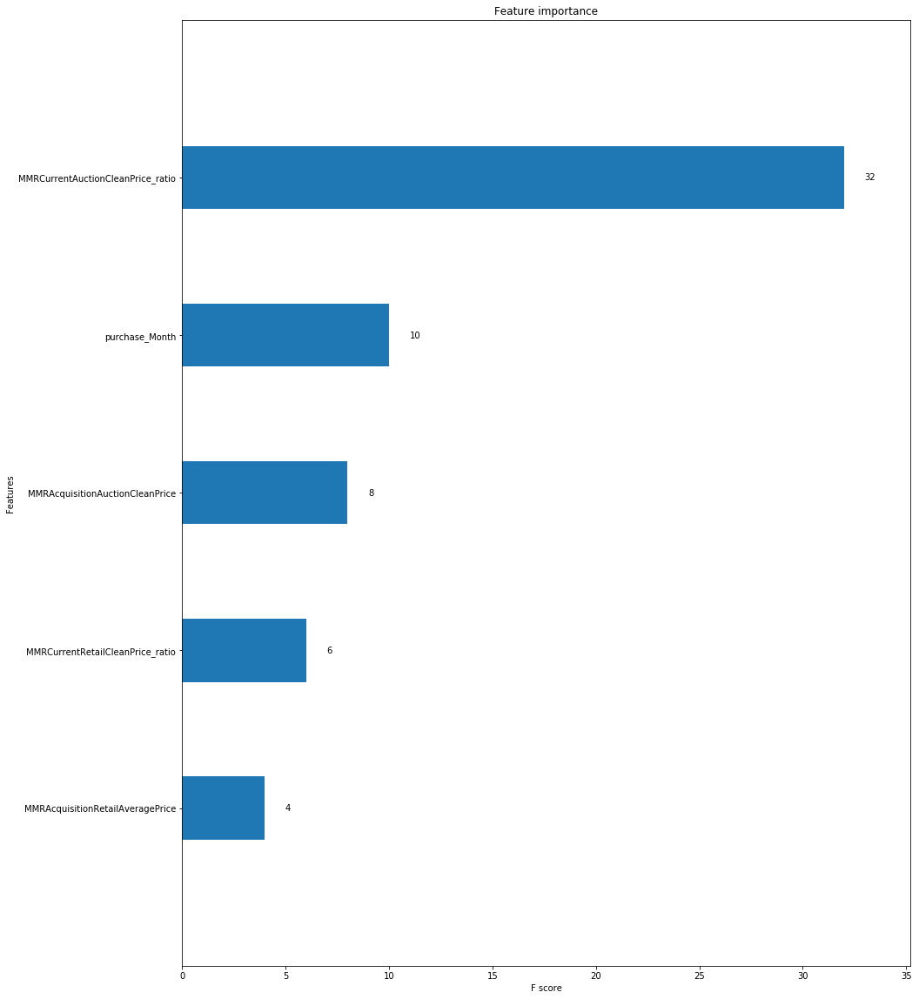
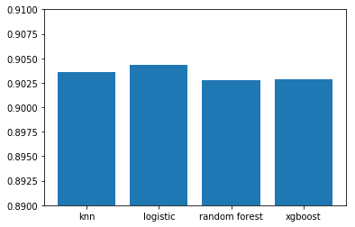

```python
# Input data files are available in the "../input/" directory.
# For example, running this (by clicking run or pressing Shift+Enter) will list the files in the input directory

import os
print(os.listdir("../input"))

# Any results you write to the current directory are saved as output.
```

    ['train_dataset.csv', 'test_dataset.csv']


```python
import pandas as pd
import matplotlib.pyplot as plt
import numpy as np
import seaborn as sns
from sklearn.feature_extraction.text import TfidfVectorizer, CountVectorizer
from sklearn.decomposition import TruncatedSVD
from sklearn import preprocessing, model_selection, metrics, ensemble
# import lightgbm as lgb
```

# Question 1

## 1a)


```python
data = pd.read_csv("../input/train_dataset.csv")
test = pd.read_csv("../input/test_dataset.csv")
# whole_data = pd.concat([data.drop('IsBadBuy',axis=1),test])
data.head()
```


<div>
<style>
    .dataframe thead tr:only-child th {
        text-align: right;
    }

    .dataframe thead th {
        text-align: left;
    }

    .dataframe tbody tr th {
        vertical-align: top;
    }
</style>
<table border="1" class="dataframe">
  <thead>
    <tr style="text-align: right;">
      <th></th>
      <th>RT13Id</th>
      <th>IsBadBuy</th>
      <th>PurchDate</th>
      <th>Auction</th>
      <th>PaintingYear</th>
      <th>PaintingAge</th>
      <th>Artist</th>
      <th>PaintingName</th>
      <th>Trim</th>
      <th>SubType</th>
      <th>...</th>
      <th>MMRCurrentRetailAveragePrice</th>
      <th>MMRCurrentRetailCleanPrice</th>
      <th>PRIMEUNIT</th>
      <th>AUCGUART</th>
      <th>BYRNO</th>
      <th>VNZIP1</th>
      <th>VNST</th>
      <th>PaintingBCost</th>
      <th>IsOnlineSale</th>
      <th>WarrantyCost</th>
    </tr>
  </thead>
  <tbody>
    <tr>
      <th>0</th>
      <td>21003</td>
      <td>0</td>
      <td>4/21/2010</td>
      <td>Christie's</td>
      <td>2007</td>
      <td>3</td>
      <td>Cai Jin</td>
      <td>TUCSON T2 T7</td>
      <td>GLS</td>
      <td>4D other</td>
      <td>...</td>
      <td>13641.0</td>
      <td>14951.0</td>
      <td>NaN</td>
      <td>NaN</td>
      <td>8655</td>
      <td>75236</td>
      <td>TX</td>
      <td>8160.0</td>
      <td>0</td>
      <td>920</td>
    </tr>
    <tr>
      <th>1</th>
      <td>57560</td>
      <td>0</td>
      <td>4/1/2009</td>
      <td>Sotheby's</td>
      <td>2004</td>
      <td>5</td>
      <td>Grandma Moses</td>
      <td>Moses T6 3.9L T6 E</td>
      <td>Bas</td>
      <td>2D Landscape</td>
      <td>...</td>
      <td>6122.0</td>
      <td>7474.0</td>
      <td>NaN</td>
      <td>NaN</td>
      <td>22808</td>
      <td>71119</td>
      <td>LA</td>
      <td>6870.0</td>
      <td>0</td>
      <td>853</td>
    </tr>
    <tr>
      <th>2</th>
      <td>29868</td>
      <td>0</td>
      <td>3/31/2010</td>
      <td>Christie's</td>
      <td>2008</td>
      <td>2</td>
      <td>Frida Kahlo</td>
      <td>AURA T6</td>
      <td>XE</td>
      <td>4D Genre XE</td>
      <td>...</td>
      <td>13509.0</td>
      <td>15918.0</td>
      <td>NaN</td>
      <td>NaN</td>
      <td>20928</td>
      <td>32824</td>
      <td>FL</td>
      <td>8680.0</td>
      <td>0</td>
      <td>1373</td>
    </tr>
    <tr>
      <th>3</th>
      <td>64473</td>
      <td>1</td>
      <td>6/16/2010</td>
      <td>Sotheby's</td>
      <td>2003</td>
      <td>7</td>
      <td>Leonardo Da Vinci</td>
      <td>MALIBU T6</td>
      <td>Bas</td>
      <td>4D Genre</td>
      <td>...</td>
      <td>5243.0</td>
      <td>6541.0</td>
      <td>NaN</td>
      <td>NaN</td>
      <td>21053</td>
      <td>85226</td>
      <td>AZ</td>
      <td>4830.0</td>
      <td>0</td>
      <td>2508</td>
    </tr>
    <tr>
      <th>4</th>
      <td>68666</td>
      <td>0</td>
      <td>11/4/2010</td>
      <td>Sotheby's</td>
      <td>2007</td>
      <td>3</td>
      <td>Leonardo Da Vinci</td>
      <td>COBALT</td>
      <td>LS</td>
      <td>4D Genre LS</td>
      <td>...</td>
      <td>8228.0</td>
      <td>9300.0</td>
      <td>NaN</td>
      <td>NaN</td>
      <td>22916</td>
      <td>80817</td>
      <td>CO</td>
      <td>4965.0</td>
      <td>0</td>
      <td>671</td>
    </tr>
  </tbody>
</table>
<p>5 rows × 34 columns</p>
</div>


```python
test_rate = 0.3
test_size = int(data.shape[0] * test_rate)
# shuffle the data frame rows without producing new index
def split_set(data, test_size):
    data = data.sample(frac=1).reset_index(drop=True)
    return np.split(data, [test_size], axis=0)
test_data, train_data = split_set(data, test_size)
print(train_data.shape, test_data.shape)
train_data.head()
```

    (35762, 34) (15326, 34)


<div>
<style>
    .dataframe thead tr:only-child th {
        text-align: right;
    }

    .dataframe thead th {
        text-align: left;
    }

    .dataframe tbody tr th {
        vertical-align: top;
    }
</style>
<table border="1" class="dataframe">
  <thead>
    <tr style="text-align: right;">
      <th></th>
      <th>RT13Id</th>
      <th>IsBadBuy</th>
      <th>PurchDate</th>
      <th>Auction</th>
      <th>PaintingYear</th>
      <th>PaintingAge</th>
      <th>Artist</th>
      <th>PaintingName</th>
      <th>Trim</th>
      <th>SubType</th>
      <th>...</th>
      <th>MMRCurrentRetailAveragePrice</th>
      <th>MMRCurrentRetailCleanPrice</th>
      <th>PRIMEUNIT</th>
      <th>AUCGUART</th>
      <th>BYRNO</th>
      <th>VNZIP1</th>
      <th>VNST</th>
      <th>PaintingBCost</th>
      <th>IsOnlineSale</th>
      <th>WarrantyCost</th>
    </tr>
  </thead>
  <tbody>
    <tr>
      <th>15326</th>
      <td>24168</td>
      <td>0</td>
      <td>5/20/2009</td>
      <td>OTHER</td>
      <td>2006</td>
      <td>3</td>
      <td>Andy Warhol</td>
      <td>Pacific T4 3.5L T6</td>
      <td>Bas</td>
      <td>4D SPORT</td>
      <td>...</td>
      <td>9394.0</td>
      <td>11153.0</td>
      <td>NaN</td>
      <td>NaN</td>
      <td>17675</td>
      <td>29697</td>
      <td>SC</td>
      <td>6800.0</td>
      <td>0</td>
      <td>1503</td>
    </tr>
    <tr>
      <th>15327</th>
      <td>41394</td>
      <td>0</td>
      <td>7/22/2010</td>
      <td>Christie's</td>
      <td>2003</td>
      <td>7</td>
      <td>Leonardo Da Vinci</td>
      <td>TRAILBLAZER EXT T2</td>
      <td>LS</td>
      <td>4D other 4.2L LS</td>
      <td>...</td>
      <td>9188.0</td>
      <td>11112.0</td>
      <td>NaN</td>
      <td>NaN</td>
      <td>18880</td>
      <td>29532</td>
      <td>SC</td>
      <td>7575.0</td>
      <td>0</td>
      <td>1641</td>
    </tr>
    <tr>
      <th>15328</th>
      <td>68621</td>
      <td>0</td>
      <td>9/23/2010</td>
      <td>Sotheby's</td>
      <td>2007</td>
      <td>3</td>
      <td>Raphael</td>
      <td>SPECTRA</td>
      <td>EX</td>
      <td>4D Genre EX</td>
      <td>...</td>
      <td>8626.0</td>
      <td>9310.0</td>
      <td>NaN</td>
      <td>NaN</td>
      <td>1235</td>
      <td>80817</td>
      <td>CO</td>
      <td>6075.0</td>
      <td>1</td>
      <td>533</td>
    </tr>
    <tr>
      <th>15329</th>
      <td>50217</td>
      <td>0</td>
      <td>2/11/2009</td>
      <td>Christie's</td>
      <td>2001</td>
      <td>8</td>
      <td>Grandma Moses</td>
      <td>ESCAPE T2 T7 2.0L I</td>
      <td>XLS</td>
      <td>4D other 2.0L XLS</td>
      <td>...</td>
      <td>3744.0</td>
      <td>4514.0</td>
      <td>NaN</td>
      <td>NaN</td>
      <td>18822</td>
      <td>78219</td>
      <td>TX</td>
      <td>4185.0</td>
      <td>0</td>
      <td>1353</td>
    </tr>
    <tr>
      <th>15330</th>
      <td>46979</td>
      <td>0</td>
      <td>6/23/2009</td>
      <td>Christie's</td>
      <td>2006</td>
      <td>3</td>
      <td>Pablo Picasso</td>
      <td>DURANGO T2 T5 4.7L</td>
      <td>SXT</td>
      <td>4D other 4.7L</td>
      <td>...</td>
      <td>9421.0</td>
      <td>10392.0</td>
      <td>NaN</td>
      <td>NaN</td>
      <td>8655</td>
      <td>75050</td>
      <td>TX</td>
      <td>8740.0</td>
      <td>0</td>
      <td>1086</td>
    </tr>
  </tbody>
</table>
<p>5 rows × 34 columns</p>
</div>


## 1b)


```python
plt.figure(figsize=[16,9], dpi=100)
data.plot.scatter("MMRCurrentRetailAveragePrice", "MMRCurrentRetailCleanPrice")
plt.show()
```


    <matplotlib.figure.Figure at 0x1a1699d470>





**It seems that it is linear.**

## 1c)


```python
data.columns
```


    Index(['RT13Id', 'IsBadBuy', 'PurchDate', 'Auction', 'PaintingYear',
           'PaintingAge', 'Artist', 'PaintingName', 'Trim', 'SubType',
           'CanvasColor', 'Market', 'FrameTypeID', 'FrameType', 'Bids',
           'Nationality', 'Size', 'TopThreeNYCName',
           'MMRAcquisitionAuctionAveragePrice', 'MMRAcquisitionAuctionCleanPrice',
           'MMRAcquisitionRetailAveragePrice', 'MMRAcquisitonRetailCleanPrice',
           'MMRCurrentAuctionAveragePrice', 'MMRCurrentAuctionCleanPrice',
           'MMRCurrentRetailAveragePrice', 'MMRCurrentRetailCleanPrice',
           'PRIMEUNIT', 'AUCGUART', 'BYRNO', 'VNZIP1', 'VNST', 'PaintingBCost',
           'IsOnlineSale', 'WarrantyCost'],
          dtype='object')


```python
need_to_plot = ['PaintingAge', 'Bids', 'WarrantyCost', 'PaintingBCost']
def plot_one_distribution(name):
    plt.figure(figsize=(16, 9))
    sns.distplot(data[name].values, bins=128, kde=False, color='g')
    plt.xlabel(name, fontsize=12)
    plt.ylabel('Number', fontsize=12)
    plt.title("{} Histogram".format(name), fontsize=16)
    plt.show()
```


```python
for n in need_to_plot:
    plot_one_distribution(n)
```














**Basically, all distributions are skewed. while 'painting age is slightly skewed, but bids and warranty cost are extremely skewed.**

# Question 2

## 2a)


```python
data = data.drop('RT13Id', axis=1)
data.head()
```


<div>
<style>
    .dataframe thead tr:only-child th {
        text-align: right;
    }

    .dataframe thead th {
        text-align: left;
    }

    .dataframe tbody tr th {
        vertical-align: top;
    }
</style>
<table border="1" class="dataframe">
  <thead>
    <tr style="text-align: right;">
      <th></th>
      <th>IsBadBuy</th>
      <th>PurchDate</th>
      <th>Auction</th>
      <th>PaintingYear</th>
      <th>PaintingAge</th>
      <th>Artist</th>
      <th>PaintingName</th>
      <th>Trim</th>
      <th>SubType</th>
      <th>CanvasColor</th>
      <th>...</th>
      <th>MMRCurrentRetailAveragePrice</th>
      <th>MMRCurrentRetailCleanPrice</th>
      <th>PRIMEUNIT</th>
      <th>AUCGUART</th>
      <th>BYRNO</th>
      <th>VNZIP1</th>
      <th>VNST</th>
      <th>PaintingBCost</th>
      <th>IsOnlineSale</th>
      <th>WarrantyCost</th>
    </tr>
  </thead>
  <tbody>
    <tr>
      <th>0</th>
      <td>0</td>
      <td>4/21/2010</td>
      <td>Christie's</td>
      <td>2007</td>
      <td>3</td>
      <td>Cai Jin</td>
      <td>TUCSON T2 T7</td>
      <td>GLS</td>
      <td>4D other</td>
      <td>SILVER</td>
      <td>...</td>
      <td>13641.0</td>
      <td>14951.0</td>
      <td>NaN</td>
      <td>NaN</td>
      <td>8655</td>
      <td>75236</td>
      <td>TX</td>
      <td>8160.0</td>
      <td>0</td>
      <td>920</td>
    </tr>
    <tr>
      <th>1</th>
      <td>0</td>
      <td>4/1/2009</td>
      <td>Sotheby's</td>
      <td>2004</td>
      <td>5</td>
      <td>Grandma Moses</td>
      <td>Moses T6 3.9L T6 E</td>
      <td>Bas</td>
      <td>2D Landscape</td>
      <td>SILVER</td>
      <td>...</td>
      <td>6122.0</td>
      <td>7474.0</td>
      <td>NaN</td>
      <td>NaN</td>
      <td>22808</td>
      <td>71119</td>
      <td>LA</td>
      <td>6870.0</td>
      <td>0</td>
      <td>853</td>
    </tr>
    <tr>
      <th>2</th>
      <td>0</td>
      <td>3/31/2010</td>
      <td>Christie's</td>
      <td>2008</td>
      <td>2</td>
      <td>Frida Kahlo</td>
      <td>AURA T6</td>
      <td>XE</td>
      <td>4D Genre XE</td>
      <td>SILVER</td>
      <td>...</td>
      <td>13509.0</td>
      <td>15918.0</td>
      <td>NaN</td>
      <td>NaN</td>
      <td>20928</td>
      <td>32824</td>
      <td>FL</td>
      <td>8680.0</td>
      <td>0</td>
      <td>1373</td>
    </tr>
    <tr>
      <th>3</th>
      <td>1</td>
      <td>6/16/2010</td>
      <td>Sotheby's</td>
      <td>2003</td>
      <td>7</td>
      <td>Leonardo Da Vinci</td>
      <td>MALIBU T6</td>
      <td>Bas</td>
      <td>4D Genre</td>
      <td>GOLD</td>
      <td>...</td>
      <td>5243.0</td>
      <td>6541.0</td>
      <td>NaN</td>
      <td>NaN</td>
      <td>21053</td>
      <td>85226</td>
      <td>AZ</td>
      <td>4830.0</td>
      <td>0</td>
      <td>2508</td>
    </tr>
    <tr>
      <th>4</th>
      <td>0</td>
      <td>11/4/2010</td>
      <td>Sotheby's</td>
      <td>2007</td>
      <td>3</td>
      <td>Leonardo Da Vinci</td>
      <td>COBALT</td>
      <td>LS</td>
      <td>4D Genre LS</td>
      <td>RED</td>
      <td>...</td>
      <td>8228.0</td>
      <td>9300.0</td>
      <td>NaN</td>
      <td>NaN</td>
      <td>22916</td>
      <td>80817</td>
      <td>CO</td>
      <td>4965.0</td>
      <td>0</td>
      <td>671</td>
    </tr>
  </tbody>
</table>
<p>5 rows × 33 columns</p>
</div>


## 2b)


```python
import re
categories = data[['PaintingName', 'SubType']]
```


```python
def extract_one_cate(name, subtype, values, idx):
    pattern = re.compile(r"T\d+")
    r1 = pattern.finditer(name)
    for rr in r1:
        values[idx][int(rr.group().replace("T", "")) - 1] = 1
    if not pd.isnull(subtype):
        r2 = pattern.finditer(subtype)
        for rr in r2:
            values[idx][int(rr.group().replace("T", "")) - 1] = 1
    if sum(values[idx]) == 0:
        values[idx][-1] = 1
    return
```


```python
one_hot_values = np.zeros([data.shape[0], 14])
for idx, row in categories.iterrows():
    extract_one_cate(row[0], row[1], one_hot_values, idx)
one_hot_values[:5]
```


    array([[0., 1., 0., 0., 0., 0., 1., 0., 0., 0., 0., 0., 0., 0.],
           [0., 0., 0., 0., 0., 1., 0., 0., 0., 0., 0., 0., 0., 0.],
           [0., 0., 0., 0., 0., 1., 0., 0., 0., 0., 0., 0., 0., 0.],
           [0., 0., 0., 0., 0., 1., 0., 0., 0., 0., 0., 0., 0., 0.],
           [0., 0., 0., 0., 0., 0., 0., 0., 0., 0., 0., 0., 0., 1.]])


```python
# the last column means the category T is not given
for i in range(14):
    data["T{}".format(i + 1)] = one_hot_values[:, i]
data.head()
```


<div>
<style>
    .dataframe thead tr:only-child th {
        text-align: right;
    }

    .dataframe thead th {
        text-align: left;
    }

    .dataframe tbody tr th {
        vertical-align: top;
    }
</style>
<table border="1" class="dataframe">
  <thead>
    <tr style="text-align: right;">
      <th></th>
      <th>IsBadBuy</th>
      <th>PurchDate</th>
      <th>Auction</th>
      <th>PaintingYear</th>
      <th>PaintingAge</th>
      <th>Artist</th>
      <th>PaintingName</th>
      <th>Trim</th>
      <th>SubType</th>
      <th>CanvasColor</th>
      <th>...</th>
      <th>T5</th>
      <th>T6</th>
      <th>T7</th>
      <th>T8</th>
      <th>T9</th>
      <th>T10</th>
      <th>T11</th>
      <th>T12</th>
      <th>T13</th>
      <th>T14</th>
    </tr>
  </thead>
  <tbody>
    <tr>
      <th>0</th>
      <td>0</td>
      <td>4/21/2010</td>
      <td>Christie's</td>
      <td>2007</td>
      <td>3</td>
      <td>Cai Jin</td>
      <td>TUCSON T2 T7</td>
      <td>GLS</td>
      <td>4D other</td>
      <td>SILVER</td>
      <td>...</td>
      <td>0.0</td>
      <td>0.0</td>
      <td>1.0</td>
      <td>0.0</td>
      <td>0.0</td>
      <td>0.0</td>
      <td>0.0</td>
      <td>0.0</td>
      <td>0.0</td>
      <td>0.0</td>
    </tr>
    <tr>
      <th>1</th>
      <td>0</td>
      <td>4/1/2009</td>
      <td>Sotheby's</td>
      <td>2004</td>
      <td>5</td>
      <td>Grandma Moses</td>
      <td>Moses T6 3.9L T6 E</td>
      <td>Bas</td>
      <td>2D Landscape</td>
      <td>SILVER</td>
      <td>...</td>
      <td>0.0</td>
      <td>1.0</td>
      <td>0.0</td>
      <td>0.0</td>
      <td>0.0</td>
      <td>0.0</td>
      <td>0.0</td>
      <td>0.0</td>
      <td>0.0</td>
      <td>0.0</td>
    </tr>
    <tr>
      <th>2</th>
      <td>0</td>
      <td>3/31/2010</td>
      <td>Christie's</td>
      <td>2008</td>
      <td>2</td>
      <td>Frida Kahlo</td>
      <td>AURA T6</td>
      <td>XE</td>
      <td>4D Genre XE</td>
      <td>SILVER</td>
      <td>...</td>
      <td>0.0</td>
      <td>1.0</td>
      <td>0.0</td>
      <td>0.0</td>
      <td>0.0</td>
      <td>0.0</td>
      <td>0.0</td>
      <td>0.0</td>
      <td>0.0</td>
      <td>0.0</td>
    </tr>
    <tr>
      <th>3</th>
      <td>1</td>
      <td>6/16/2010</td>
      <td>Sotheby's</td>
      <td>2003</td>
      <td>7</td>
      <td>Leonardo Da Vinci</td>
      <td>MALIBU T6</td>
      <td>Bas</td>
      <td>4D Genre</td>
      <td>GOLD</td>
      <td>...</td>
      <td>0.0</td>
      <td>1.0</td>
      <td>0.0</td>
      <td>0.0</td>
      <td>0.0</td>
      <td>0.0</td>
      <td>0.0</td>
      <td>0.0</td>
      <td>0.0</td>
      <td>0.0</td>
    </tr>
    <tr>
      <th>4</th>
      <td>0</td>
      <td>11/4/2010</td>
      <td>Sotheby's</td>
      <td>2007</td>
      <td>3</td>
      <td>Leonardo Da Vinci</td>
      <td>COBALT</td>
      <td>LS</td>
      <td>4D Genre LS</td>
      <td>RED</td>
      <td>...</td>
      <td>0.0</td>
      <td>0.0</td>
      <td>0.0</td>
      <td>0.0</td>
      <td>0.0</td>
      <td>0.0</td>
      <td>0.0</td>
      <td>0.0</td>
      <td>0.0</td>
      <td>1.0</td>
    </tr>
  </tbody>
</table>
<p>5 rows × 47 columns</p>
</div>


## 2c)


```python
def extract_one_num_check(name, values, idx):
    pattern = re.compile(r"I.?\d")
    outpattern = re.compile(r"\d+")
    r = pattern.search(name)
    if r:
        rr = outpattern.search(r.group()).group()
        values[idx] = int(rr)
        return
```


```python
# 0 here means not given
num_check = np.zeros(data.shape[0])
names = data[['PaintingName']]
for idx, row in names.iterrows():
    extract_one_num_check(row[0], num_check, idx)
num_check[:10]
```


    array([0., 0., 0., 0., 0., 0., 0., 0., 4., 0.])


```python
data["num_checked"] = num_check
```

## 2d)


```python
def extract_one_size(name, values, idx):
    pattern = re.compile(r"\d.?\d?L")
    outpattern = re.compile(r"\d.?\d?")
    r = pattern.search(name)
    if r:
        rr = outpattern.search(r.group()).group()
        values[idx] = float(rr)
        return
```


```python
# zeros here means not given
sizes = np.zeros(data.shape[0])
names = data[['PaintingName']]
for idx, row in names.iterrows():
    extract_one_size(row[0], sizes, idx)
sizes[:10]
```


    array([0. , 3.9, 0. , 0. , 0. , 0. , 0. , 0. , 2. , 0. ])


```python
data["given_size"] = sizes
```

## 2e)


```python
_cates = ['Not Given', 'Genre', 'History', 'Still Life', 'Real Life', 'Landscape', 'Portrait', 'Fine Art']
cates_to_id = {v: k for k, v in enumerate(_cates)}
id_to_cates = {k: v for k, v in enumerate(_cates)}
```


```python
def extract_one_cate_2(subt, _cates, dic, values, idx):
    for c in _cates:
        if  not pd.isnull(subt) and subt.find(c) >= 0:
            values[idx] = dic[c]
            return
    return
```


```python
types = data[['SubType']]
cates_2 = np.zeros(data.shape[0], np.int8)
for idx, row in types.iterrows():
    extract_one_cate_2(row[0], _cates, cates_to_id, cates_2, idx)
print(cates_2[:10])
for t in cates_2[:10]:
    print(id_to_cates[t])
```

    [0 5 1 1 1 1 0 1 1 6]
    Not Given
    Landscape
    Genre
    Genre
    Genre
    Genre
    Not Given
    Genre
    Genre
    Portrait


```python
df_tmp = pd.DataFrame({'cate_': [id_to_cates[t] for t in cates_2]})
df_tmp = pd.get_dummies(df_tmp, prefix=['cate_'], drop_first=True)
data = pd.concat([data, df_tmp], axis=1)
data.head()
```


<div>
<style>
    .dataframe thead tr:only-child th {
        text-align: right;
    }

    .dataframe thead th {
        text-align: left;
    }

    .dataframe tbody tr th {
        vertical-align: top;
    }
</style>
<table border="1" class="dataframe">
  <thead>
    <tr style="text-align: right;">
      <th></th>
      <th>IsBadBuy</th>
      <th>PurchDate</th>
      <th>Auction</th>
      <th>PaintingYear</th>
      <th>PaintingAge</th>
      <th>Artist</th>
      <th>PaintingName</th>
      <th>Trim</th>
      <th>SubType</th>
      <th>CanvasColor</th>
      <th>...</th>
      <th>T14</th>
      <th>num_checked</th>
      <th>given_size</th>
      <th>cate__Genre</th>
      <th>cate__History</th>
      <th>cate__Landscape</th>
      <th>cate__Not Given</th>
      <th>cate__Portrait</th>
      <th>cate__Real Life</th>
      <th>cate__Still Life</th>
    </tr>
  </thead>
  <tbody>
    <tr>
      <th>0</th>
      <td>0</td>
      <td>4/21/2010</td>
      <td>Christie's</td>
      <td>2007</td>
      <td>3</td>
      <td>Cai Jin</td>
      <td>TUCSON T2 T7</td>
      <td>GLS</td>
      <td>4D other</td>
      <td>SILVER</td>
      <td>...</td>
      <td>0.0</td>
      <td>0.0</td>
      <td>0.0</td>
      <td>0</td>
      <td>0</td>
      <td>0</td>
      <td>1</td>
      <td>0</td>
      <td>0</td>
      <td>0</td>
    </tr>
    <tr>
      <th>1</th>
      <td>0</td>
      <td>4/1/2009</td>
      <td>Sotheby's</td>
      <td>2004</td>
      <td>5</td>
      <td>Grandma Moses</td>
      <td>Moses T6 3.9L T6 E</td>
      <td>Bas</td>
      <td>2D Landscape</td>
      <td>SILVER</td>
      <td>...</td>
      <td>0.0</td>
      <td>0.0</td>
      <td>3.9</td>
      <td>0</td>
      <td>0</td>
      <td>1</td>
      <td>0</td>
      <td>0</td>
      <td>0</td>
      <td>0</td>
    </tr>
    <tr>
      <th>2</th>
      <td>0</td>
      <td>3/31/2010</td>
      <td>Christie's</td>
      <td>2008</td>
      <td>2</td>
      <td>Frida Kahlo</td>
      <td>AURA T6</td>
      <td>XE</td>
      <td>4D Genre XE</td>
      <td>SILVER</td>
      <td>...</td>
      <td>0.0</td>
      <td>0.0</td>
      <td>0.0</td>
      <td>1</td>
      <td>0</td>
      <td>0</td>
      <td>0</td>
      <td>0</td>
      <td>0</td>
      <td>0</td>
    </tr>
    <tr>
      <th>3</th>
      <td>1</td>
      <td>6/16/2010</td>
      <td>Sotheby's</td>
      <td>2003</td>
      <td>7</td>
      <td>Leonardo Da Vinci</td>
      <td>MALIBU T6</td>
      <td>Bas</td>
      <td>4D Genre</td>
      <td>GOLD</td>
      <td>...</td>
      <td>0.0</td>
      <td>0.0</td>
      <td>0.0</td>
      <td>1</td>
      <td>0</td>
      <td>0</td>
      <td>0</td>
      <td>0</td>
      <td>0</td>
      <td>0</td>
    </tr>
    <tr>
      <th>4</th>
      <td>0</td>
      <td>11/4/2010</td>
      <td>Sotheby's</td>
      <td>2007</td>
      <td>3</td>
      <td>Leonardo Da Vinci</td>
      <td>COBALT</td>
      <td>LS</td>
      <td>4D Genre LS</td>
      <td>RED</td>
      <td>...</td>
      <td>1.0</td>
      <td>0.0</td>
      <td>0.0</td>
      <td>1</td>
      <td>0</td>
      <td>0</td>
      <td>0</td>
      <td>0</td>
      <td>0</td>
      <td>0</td>
    </tr>
  </tbody>
</table>
<p>5 rows × 56 columns</p>
</div>


## 2f)


```python
prices = ['MMRAcquisitionAuctionAveragePrice', 'MMRAcquisitionAuctionCleanPrice',
       'MMRAcquisitionRetailAveragePrice', 'MMRAcquisitonRetailCleanPrice',
       'MMRCurrentAuctionAveragePrice', 'MMRCurrentAuctionCleanPrice',
       'MMRCurrentRetailAveragePrice', 'MMRCurrentRetailCleanPrice',]
for p in prices:
    data = data.loc[data[p] != 0]
    data["{}_ratio".format(p)] = data["Bids"] / data[p]

data.head()
```


<div>
<style>
    .dataframe thead tr:only-child th {
        text-align: right;
    }

    .dataframe thead th {
        text-align: left;
    }

    .dataframe tbody tr th {
        vertical-align: top;
    }
</style>
<table border="1" class="dataframe">
  <thead>
    <tr style="text-align: right;">
      <th></th>
      <th>IsBadBuy</th>
      <th>PurchDate</th>
      <th>Auction</th>
      <th>PaintingYear</th>
      <th>PaintingAge</th>
      <th>Artist</th>
      <th>PaintingName</th>
      <th>Trim</th>
      <th>SubType</th>
      <th>CanvasColor</th>
      <th>...</th>
      <th>cate__Real Life</th>
      <th>cate__Still Life</th>
      <th>MMRAcquisitionAuctionAveragePrice_ratio</th>
      <th>MMRAcquisitionAuctionCleanPrice_ratio</th>
      <th>MMRAcquisitionRetailAveragePrice_ratio</th>
      <th>MMRAcquisitonRetailCleanPrice_ratio</th>
      <th>MMRCurrentAuctionAveragePrice_ratio</th>
      <th>MMRCurrentAuctionCleanPrice_ratio</th>
      <th>MMRCurrentRetailAveragePrice_ratio</th>
      <th>MMRCurrentRetailCleanPrice_ratio</th>
    </tr>
  </thead>
  <tbody>
    <tr>
      <th>0</th>
      <td>0</td>
      <td>4/21/2010</td>
      <td>Christie's</td>
      <td>2007</td>
      <td>3</td>
      <td>Cai Jin</td>
      <td>TUCSON T2 T7</td>
      <td>GLS</td>
      <td>4D other</td>
      <td>SILVER</td>
      <td>...</td>
      <td>0</td>
      <td>0</td>
      <td>8.575855</td>
      <td>7.490121</td>
      <td>6.209689</td>
      <td>5.602900</td>
      <td>8.104874</td>
      <td>7.167936</td>
      <td>5.863720</td>
      <td>5.349943</td>
    </tr>
    <tr>
      <th>1</th>
      <td>0</td>
      <td>4/1/2009</td>
      <td>Sotheby's</td>
      <td>2004</td>
      <td>5</td>
      <td>Grandma Moses</td>
      <td>Moses T6 3.9L T6 E</td>
      <td>Bas</td>
      <td>2D Landscape</td>
      <td>SILVER</td>
      <td>...</td>
      <td>0</td>
      <td>0</td>
      <td>15.002756</td>
      <td>12.026510</td>
      <td>12.803387</td>
      <td>10.425124</td>
      <td>15.685747</td>
      <td>12.646740</td>
      <td>13.338778</td>
      <td>10.925876</td>
    </tr>
    <tr>
      <th>2</th>
      <td>0</td>
      <td>3/31/2010</td>
      <td>Christie's</td>
      <td>2008</td>
      <td>2</td>
      <td>Frida Kahlo</td>
      <td>AURA T6</td>
      <td>XE</td>
      <td>4D Genre XE</td>
      <td>SILVER</td>
      <td>...</td>
      <td>0</td>
      <td>0</td>
      <td>7.956712</td>
      <td>7.132863</td>
      <td>6.008796</td>
      <td>5.527849</td>
      <td>8.233203</td>
      <td>7.191053</td>
      <td>6.068399</td>
      <td>5.150019</td>
    </tr>
    <tr>
      <th>3</th>
      <td>1</td>
      <td>6/16/2010</td>
      <td>Sotheby's</td>
      <td>2003</td>
      <td>7</td>
      <td>Leonardo Da Vinci</td>
      <td>MALIBU T6</td>
      <td>Bas</td>
      <td>4D Genre</td>
      <td>GOLD</td>
      <td>...</td>
      <td>0</td>
      <td>0</td>
      <td>33.343656</td>
      <td>23.385822</td>
      <td>14.476937</td>
      <td>12.280057</td>
      <td>33.487689</td>
      <td>23.231645</td>
      <td>14.786191</td>
      <td>11.852010</td>
    </tr>
    <tr>
      <th>4</th>
      <td>0</td>
      <td>11/4/2010</td>
      <td>Sotheby's</td>
      <td>2007</td>
      <td>3</td>
      <td>Leonardo Da Vinci</td>
      <td>COBALT</td>
      <td>LS</td>
      <td>4D Genre LS</td>
      <td>RED</td>
      <td>...</td>
      <td>0</td>
      <td>0</td>
      <td>10.798450</td>
      <td>9.091841</td>
      <td>6.870934</td>
      <td>6.042136</td>
      <td>12.008621</td>
      <td>10.038778</td>
      <td>7.110598</td>
      <td>6.290968</td>
    </tr>
  </tbody>
</table>
<p>5 rows × 64 columns</p>
</div>


## 2g)


```python
factors = ["Artist", "CanvasColor","Market","Nationality","Auction"]

for f in factors:
    df_tmp = data[[f]]
    df_tmp = pd.get_dummies(df_tmp, prefix=[f], drop_first=True)
    data = pd.concat([data, df_tmp], axis=1)
data.head(20)
```


<div>
<style>
    .dataframe thead tr:only-child th {
        text-align: right;
    }

    .dataframe thead th {
        text-align: left;
    }

    .dataframe tbody tr th {
        vertical-align: top;
    }
</style>
<table border="1" class="dataframe">
  <thead>
    <tr style="text-align: right;">
      <th></th>
      <th>IsBadBuy</th>
      <th>PurchDate</th>
      <th>Auction</th>
      <th>PaintingYear</th>
      <th>PaintingAge</th>
      <th>Artist</th>
      <th>PaintingName</th>
      <th>Trim</th>
      <th>SubType</th>
      <th>CanvasColor</th>
      <th>...</th>
      <th>CanvasColor_RED</th>
      <th>CanvasColor_SILVER</th>
      <th>CanvasColor_WHITE</th>
      <th>CanvasColor_YELLOW</th>
      <th>Market_Non Commercial</th>
      <th>Nationality_OTHER</th>
      <th>Nationality_OTHER ASIAN</th>
      <th>Nationality_TOP LINE ASIAN</th>
      <th>Auction_OTHER</th>
      <th>Auction_Sotheby's</th>
    </tr>
  </thead>
  <tbody>
    <tr>
      <th>0</th>
      <td>0</td>
      <td>4/21/2010</td>
      <td>Christie's</td>
      <td>2007</td>
      <td>3</td>
      <td>Cai Jin</td>
      <td>TUCSON T2 T7</td>
      <td>GLS</td>
      <td>4D other</td>
      <td>SILVER</td>
      <td>...</td>
      <td>0</td>
      <td>1</td>
      <td>0</td>
      <td>0</td>
      <td>0</td>
      <td>0</td>
      <td>1</td>
      <td>0</td>
      <td>0</td>
      <td>0</td>
    </tr>
    <tr>
      <th>1</th>
      <td>0</td>
      <td>4/1/2009</td>
      <td>Sotheby's</td>
      <td>2004</td>
      <td>5</td>
      <td>Grandma Moses</td>
      <td>Moses T6 3.9L T6 E</td>
      <td>Bas</td>
      <td>2D Landscape</td>
      <td>SILVER</td>
      <td>...</td>
      <td>0</td>
      <td>1</td>
      <td>0</td>
      <td>0</td>
      <td>0</td>
      <td>0</td>
      <td>0</td>
      <td>0</td>
      <td>0</td>
      <td>1</td>
    </tr>
    <tr>
      <th>2</th>
      <td>0</td>
      <td>3/31/2010</td>
      <td>Christie's</td>
      <td>2008</td>
      <td>2</td>
      <td>Frida Kahlo</td>
      <td>AURA T6</td>
      <td>XE</td>
      <td>4D Genre XE</td>
      <td>SILVER</td>
      <td>...</td>
      <td>0</td>
      <td>1</td>
      <td>0</td>
      <td>0</td>
      <td>0</td>
      <td>0</td>
      <td>0</td>
      <td>0</td>
      <td>0</td>
      <td>0</td>
    </tr>
    <tr>
      <th>3</th>
      <td>1</td>
      <td>6/16/2010</td>
      <td>Sotheby's</td>
      <td>2003</td>
      <td>7</td>
      <td>Leonardo Da Vinci</td>
      <td>MALIBU T6</td>
      <td>Bas</td>
      <td>4D Genre</td>
      <td>GOLD</td>
      <td>...</td>
      <td>0</td>
      <td>0</td>
      <td>0</td>
      <td>0</td>
      <td>0</td>
      <td>0</td>
      <td>0</td>
      <td>0</td>
      <td>0</td>
      <td>1</td>
    </tr>
    <tr>
      <th>4</th>
      <td>0</td>
      <td>11/4/2010</td>
      <td>Sotheby's</td>
      <td>2007</td>
      <td>3</td>
      <td>Leonardo Da Vinci</td>
      <td>COBALT</td>
      <td>LS</td>
      <td>4D Genre LS</td>
      <td>RED</td>
      <td>...</td>
      <td>1</td>
      <td>0</td>
      <td>0</td>
      <td>0</td>
      <td>0</td>
      <td>0</td>
      <td>0</td>
      <td>0</td>
      <td>0</td>
      <td>1</td>
    </tr>
    <tr>
      <th>5</th>
      <td>0</td>
      <td>1/13/2010</td>
      <td>Sotheby's</td>
      <td>2006</td>
      <td>4</td>
      <td>Michelangelo</td>
      <td>David</td>
      <td>Bas</td>
      <td>4D Genre</td>
      <td>GREY</td>
      <td>...</td>
      <td>0</td>
      <td>0</td>
      <td>0</td>
      <td>0</td>
      <td>0</td>
      <td>0</td>
      <td>0</td>
      <td>1</td>
      <td>0</td>
      <td>1</td>
    </tr>
    <tr>
      <th>6</th>
      <td>1</td>
      <td>2/19/2009</td>
      <td>Christie's</td>
      <td>2003</td>
      <td>6</td>
      <td>Leonardo Da Vinci</td>
      <td>TRAILBLAZER T2 T8 4</td>
      <td>LS</td>
      <td>4D other 4.2L LS</td>
      <td>GREEN</td>
      <td>...</td>
      <td>0</td>
      <td>0</td>
      <td>0</td>
      <td>0</td>
      <td>0</td>
      <td>0</td>
      <td>0</td>
      <td>0</td>
      <td>0</td>
      <td>0</td>
    </tr>
    <tr>
      <th>7</th>
      <td>0</td>
      <td>1/21/2010</td>
      <td>Christie's</td>
      <td>2006</td>
      <td>4</td>
      <td>Qu Ding</td>
      <td>G6 T6</td>
      <td>Bas</td>
      <td>4D Genre</td>
      <td>RED</td>
      <td>...</td>
      <td>1</td>
      <td>0</td>
      <td>0</td>
      <td>0</td>
      <td>0</td>
      <td>0</td>
      <td>0</td>
      <td>0</td>
      <td>0</td>
      <td>0</td>
    </tr>
    <tr>
      <th>8</th>
      <td>1</td>
      <td>9/3/2009</td>
      <td>Christie's</td>
      <td>2005</td>
      <td>4</td>
      <td>Pablo Picasso</td>
      <td>NEON 2.0L I4 T11I</td>
      <td>SXT</td>
      <td>4D Genre</td>
      <td>RED</td>
      <td>...</td>
      <td>1</td>
      <td>0</td>
      <td>0</td>
      <td>0</td>
      <td>0</td>
      <td>0</td>
      <td>0</td>
      <td>0</td>
      <td>0</td>
      <td>0</td>
    </tr>
    <tr>
      <th>9</th>
      <td>0</td>
      <td>1/27/2009</td>
      <td>Christie's</td>
      <td>2005</td>
      <td>4</td>
      <td>Pablo Picasso</td>
      <td>CARAEnlarged GRAND T4 T6</td>
      <td>SE</td>
      <td>Portrait 3.3L</td>
      <td>GOLD</td>
      <td>...</td>
      <td>0</td>
      <td>0</td>
      <td>0</td>
      <td>0</td>
      <td>0</td>
      <td>0</td>
      <td>0</td>
      <td>0</td>
      <td>0</td>
      <td>0</td>
    </tr>
    <tr>
      <th>10</th>
      <td>0</td>
      <td>10/7/2009</td>
      <td>Sotheby's</td>
      <td>2007</td>
      <td>2</td>
      <td>Leonardo Da Vinci</td>
      <td>Monalisa T6 3.5L T6 T11</td>
      <td>LT</td>
      <td>4D Genre LT 3.5L</td>
      <td>BLACK</td>
      <td>...</td>
      <td>0</td>
      <td>0</td>
      <td>0</td>
      <td>0</td>
      <td>0</td>
      <td>0</td>
      <td>0</td>
      <td>0</td>
      <td>0</td>
      <td>1</td>
    </tr>
    <tr>
      <th>11</th>
      <td>0</td>
      <td>11/20/2009</td>
      <td>OTHER</td>
      <td>2005</td>
      <td>4</td>
      <td>Frida Kahlo</td>
      <td>VUE T2 T6</td>
      <td>NaN</td>
      <td>4D other 3.0L</td>
      <td>BLUE</td>
      <td>...</td>
      <td>0</td>
      <td>0</td>
      <td>0</td>
      <td>0</td>
      <td>0</td>
      <td>0</td>
      <td>0</td>
      <td>0</td>
      <td>1</td>
      <td>0</td>
    </tr>
    <tr>
      <th>12</th>
      <td>0</td>
      <td>11/11/2010</td>
      <td>OTHER</td>
      <td>2006</td>
      <td>4</td>
      <td>Grandma Moses</td>
      <td>Moses T6</td>
      <td>Bas</td>
      <td>2D Landscape</td>
      <td>GREY</td>
      <td>...</td>
      <td>0</td>
      <td>0</td>
      <td>0</td>
      <td>0</td>
      <td>1</td>
      <td>0</td>
      <td>0</td>
      <td>0</td>
      <td>1</td>
      <td>0</td>
    </tr>
    <tr>
      <th>13</th>
      <td>0</td>
      <td>9/16/2010</td>
      <td>Christie's</td>
      <td>2005</td>
      <td>5</td>
      <td>Grandma Moses</td>
      <td>EXPLORER T2 T6</td>
      <td>XLT</td>
      <td>4D other 4.0L FFV XLT</td>
      <td>BLUE</td>
      <td>...</td>
      <td>0</td>
      <td>0</td>
      <td>0</td>
      <td>0</td>
      <td>0</td>
      <td>0</td>
      <td>0</td>
      <td>0</td>
      <td>0</td>
      <td>0</td>
    </tr>
    <tr>
      <th>14</th>
      <td>0</td>
      <td>2/25/2010</td>
      <td>Christie's</td>
      <td>2003</td>
      <td>7</td>
      <td>Grandma Moses</td>
      <td>Hounds</td>
      <td>SE</td>
      <td>4D Genre SE</td>
      <td>SILVER</td>
      <td>...</td>
      <td>0</td>
      <td>1</td>
      <td>0</td>
      <td>0</td>
      <td>0</td>
      <td>0</td>
      <td>0</td>
      <td>0</td>
      <td>0</td>
      <td>0</td>
    </tr>
    <tr>
      <th>15</th>
      <td>0</td>
      <td>4/23/2009</td>
      <td>Christie's</td>
      <td>2006</td>
      <td>3</td>
      <td>Pablo Picasso</td>
      <td>STRATUS T7 2.4L I4 S</td>
      <td>SXT</td>
      <td>4D Genre SXT</td>
      <td>BLUE</td>
      <td>...</td>
      <td>0</td>
      <td>0</td>
      <td>0</td>
      <td>0</td>
      <td>0</td>
      <td>0</td>
      <td>0</td>
      <td>0</td>
      <td>0</td>
      <td>0</td>
    </tr>
    <tr>
      <th>16</th>
      <td>0</td>
      <td>5/25/2010</td>
      <td>OTHER</td>
      <td>2006</td>
      <td>4</td>
      <td>Leonardo Da Vinci</td>
      <td>AVEO</td>
      <td>LS</td>
      <td>4D Genre LS</td>
      <td>RED</td>
      <td>...</td>
      <td>1</td>
      <td>0</td>
      <td>0</td>
      <td>0</td>
      <td>0</td>
      <td>0</td>
      <td>0</td>
      <td>0</td>
      <td>1</td>
      <td>0</td>
    </tr>
    <tr>
      <th>17</th>
      <td>0</td>
      <td>5/19/2009</td>
      <td>OTHER</td>
      <td>2002</td>
      <td>7</td>
      <td>Buick</td>
      <td>LE SABRE Unspecified</td>
      <td>Cus</td>
      <td>4D Genre CUSTOM</td>
      <td>GREY</td>
      <td>...</td>
      <td>0</td>
      <td>0</td>
      <td>0</td>
      <td>0</td>
      <td>0</td>
      <td>0</td>
      <td>0</td>
      <td>0</td>
      <td>1</td>
      <td>0</td>
    </tr>
    <tr>
      <th>18</th>
      <td>0</td>
      <td>1/14/2009</td>
      <td>OTHER</td>
      <td>2005</td>
      <td>4</td>
      <td>Andy Warhol</td>
      <td>TOWN &amp; COUNTRY T4 V</td>
      <td>LX</td>
      <td>Portrait 3.3L LX</td>
      <td>BLUE</td>
      <td>...</td>
      <td>0</td>
      <td>0</td>
      <td>0</td>
      <td>0</td>
      <td>0</td>
      <td>0</td>
      <td>0</td>
      <td>0</td>
      <td>1</td>
      <td>0</td>
    </tr>
    <tr>
      <th>19</th>
      <td>0</td>
      <td>6/3/2009</td>
      <td>Sotheby's</td>
      <td>2006</td>
      <td>3</td>
      <td>Andy Warhol</td>
      <td>Pacific T4 3.5L T6</td>
      <td>Bas</td>
      <td>4D SPORT</td>
      <td>SILVER</td>
      <td>...</td>
      <td>0</td>
      <td>1</td>
      <td>0</td>
      <td>0</td>
      <td>0</td>
      <td>0</td>
      <td>0</td>
      <td>0</td>
      <td>0</td>
      <td>1</td>
    </tr>
  </tbody>
</table>
<p>20 rows × 116 columns</p>
</div>


```python
f = "PaintingYear"
unique_years = list(set(data[f].tolist()))
dic = {v: k for k, v in enumerate(unique_years)}
years = [dic[y] for y in data[f].tolist()]
yys = np.zeros([data.shape[0], len(dic)])
for i, y in enumerate(years):
    yys[i][y] = 1

for i, k in enumerate(dic):
    data[str(k)] = yys[:, i]
data.head()
```


<div>
<style>
    .dataframe thead tr:only-child th {
        text-align: right;
    }

    .dataframe thead th {
        text-align: left;
    }

    .dataframe tbody tr th {
        vertical-align: top;
    }
</style>
<table border="1" class="dataframe">
  <thead>
    <tr style="text-align: right;">
      <th></th>
      <th>IsBadBuy</th>
      <th>PurchDate</th>
      <th>Auction</th>
      <th>PaintingYear</th>
      <th>PaintingAge</th>
      <th>Artist</th>
      <th>PaintingName</th>
      <th>Trim</th>
      <th>SubType</th>
      <th>CanvasColor</th>
      <th>...</th>
      <th>2001</th>
      <th>2002</th>
      <th>2003</th>
      <th>2004</th>
      <th>2005</th>
      <th>2006</th>
      <th>2007</th>
      <th>2008</th>
      <th>2009</th>
      <th>2010</th>
    </tr>
  </thead>
  <tbody>
    <tr>
      <th>0</th>
      <td>0</td>
      <td>4/21/2010</td>
      <td>Christie's</td>
      <td>2007</td>
      <td>3</td>
      <td>Cai Jin</td>
      <td>TUCSON T2 T7</td>
      <td>GLS</td>
      <td>4D other</td>
      <td>SILVER</td>
      <td>...</td>
      <td>0.0</td>
      <td>0.0</td>
      <td>0.0</td>
      <td>0.0</td>
      <td>0.0</td>
      <td>0.0</td>
      <td>1.0</td>
      <td>0.0</td>
      <td>0.0</td>
      <td>0.0</td>
    </tr>
    <tr>
      <th>1</th>
      <td>0</td>
      <td>4/1/2009</td>
      <td>Sotheby's</td>
      <td>2004</td>
      <td>5</td>
      <td>Grandma Moses</td>
      <td>Moses T6 3.9L T6 E</td>
      <td>Bas</td>
      <td>2D Landscape</td>
      <td>SILVER</td>
      <td>...</td>
      <td>0.0</td>
      <td>0.0</td>
      <td>0.0</td>
      <td>1.0</td>
      <td>0.0</td>
      <td>0.0</td>
      <td>0.0</td>
      <td>0.0</td>
      <td>0.0</td>
      <td>0.0</td>
    </tr>
    <tr>
      <th>2</th>
      <td>0</td>
      <td>3/31/2010</td>
      <td>Christie's</td>
      <td>2008</td>
      <td>2</td>
      <td>Frida Kahlo</td>
      <td>AURA T6</td>
      <td>XE</td>
      <td>4D Genre XE</td>
      <td>SILVER</td>
      <td>...</td>
      <td>0.0</td>
      <td>0.0</td>
      <td>0.0</td>
      <td>0.0</td>
      <td>0.0</td>
      <td>0.0</td>
      <td>0.0</td>
      <td>1.0</td>
      <td>0.0</td>
      <td>0.0</td>
    </tr>
    <tr>
      <th>3</th>
      <td>1</td>
      <td>6/16/2010</td>
      <td>Sotheby's</td>
      <td>2003</td>
      <td>7</td>
      <td>Leonardo Da Vinci</td>
      <td>MALIBU T6</td>
      <td>Bas</td>
      <td>4D Genre</td>
      <td>GOLD</td>
      <td>...</td>
      <td>0.0</td>
      <td>0.0</td>
      <td>1.0</td>
      <td>0.0</td>
      <td>0.0</td>
      <td>0.0</td>
      <td>0.0</td>
      <td>0.0</td>
      <td>0.0</td>
      <td>0.0</td>
    </tr>
    <tr>
      <th>4</th>
      <td>0</td>
      <td>11/4/2010</td>
      <td>Sotheby's</td>
      <td>2007</td>
      <td>3</td>
      <td>Leonardo Da Vinci</td>
      <td>COBALT</td>
      <td>LS</td>
      <td>4D Genre LS</td>
      <td>RED</td>
      <td>...</td>
      <td>0.0</td>
      <td>0.0</td>
      <td>0.0</td>
      <td>0.0</td>
      <td>0.0</td>
      <td>0.0</td>
      <td>1.0</td>
      <td>0.0</td>
      <td>0.0</td>
      <td>0.0</td>
    </tr>
  </tbody>
</table>
<p>5 rows × 126 columns</p>
</div>


# Question 3


```python
# More feature engineering here
```


```python
#separating day, month, year from purchase date
```


```python
purdate = ['purchase_Month','purchase_Day','purchase_Year']
```


```python
for idx in range(len(purdate)):
    data[purdate[idx]] = data['PurchDate'].map(lambda x: int(x.split('/')[idx]))
```


```python
# now we have prepared the training dataset already, we will filter out the predictors to build predictive models
```


```python
features_not_used = ['PurchDate',"Auction",'PaintingYear','Artist','PaintingName','Trim','SubType',
                     'CanvasColor','Market','FrameType','TopThreeNYCName','Size',"PRIMEUNIT",
                    "AUCGUART","VNST","Nationality"]
data_train = data.drop(features_not_used,axis=1)
data_train = data_train.dropna(axis=0)
data_train = data_train
```


```python
from sklearn.model_selection import cross_val_score
X = data_train.drop('IsBadBuy',axis=1)
y = data_train['IsBadBuy']
```


```python
# model performance
model_name = []
model_accuracy = []
```


```python
## logistic regression
```


```python
from sklearn.linear_model import LogisticRegression 
 
glm_fit = LogisticRegression()  # 使用类，参数全是默认的
scores_glm = cross_val_score(glm_fit, X, y,cv=5).mean()
```


```python
model_name.append('logistic')
model_accuracy.append(scores_glm)
scores_glm
```


    0.9042922827965787


```python
##Knn
```


```python
from sklearn.neighbors import KNeighborsClassifier
# model_knn = KNeighborsClassifier(n_neighbors = 1)
# cross_val_score(model_knn,X,y,cv=5).mean()
score = []
for k in range(10):
    model_knn = KNeighborsClassifier(n_neighbors = k+1)
    score.append(cross_val_score(model_knn,X,y,cv=5).mean())
```


```python
plt.plot(np.array(range(10))+1 ,score)
plt.show()
```





```python
knn_acc = max(score)
model_name.append('knn')
model_accuracy.append(knn_acc)
knn_acc
```


    0.9036265003708437


```python
#####random forest
```


```python
from sklearn.ensemble import RandomForestClassifier
from sklearn.ensemble import ExtraTreesClassifier
from sklearn.tree import DecisionTreeClassifier
```


```python
clf_dt = DecisionTreeClassifier(max_depth=None, 
                                min_samples_split=2,random_state=0)
scores_dt = cross_val_score(clf_dt, X, y,cv=5).mean()
print(scores_dt)    

 
clf_rf = RandomForestClassifier(n_estimators=10, max_depth=None,
                                min_samples_split=2, random_state=0)
scores_rf = cross_val_score(clf_rf, X, y,cv=5).mean()
print(scores_rf)

clf_et = ExtraTreesClassifier(n_estimators=10, max_depth=None,
                              min_samples_split=2, random_state=0)
scores_et = cross_val_score(clf_et, X, y,cv=5).mean()
print(scores_et)
```

    0.8189666909220369
    0.9027318222276595
    0.9000270562313769


```python
rf_acc = max(scores_dt,scores_rf,scores_et)
model_name.append('random forest')
model_accuracy.append(rf_acc)
rf_acc
```


    0.9027318222276595


```python
feat = X.columns
```


```python
clf_rf = RandomForestClassifier(n_estimators=10, max_depth=None,
                                min_samples_split=2, random_state=0)
clf_rf_fit = clf_rf.fit(X,y)
importances = clf_rf_fit.feature_importances_
indices = np.argsort(importances)[::-1]
for f in range(X.shape[1]):
    print("%2d) %-*s %f" %(f+1,30,feat[f],importances[indices[f]]))
```

     1) PaintingAge                    0.041733
     2) FrameTypeID                    0.041544
     3) Bids                           0.040878
     4) MMRAcquisitionAuctionAveragePrice 0.039208
     5) MMRAcquisitionAuctionCleanPrice 0.038716
     6) MMRAcquisitionRetailAveragePrice 0.037156
     7) MMRAcquisitonRetailCleanPrice  0.037007
     8) MMRCurrentAuctionAveragePrice  0.036681
     9) MMRCurrentAuctionCleanPrice    0.036547
    10) MMRCurrentRetailAveragePrice   0.036486
    11) MMRCurrentRetailCleanPrice     0.036365
    12) BYRNO                          0.036227
    13) VNZIP1                         0.035952
    14) PaintingBCost                  0.035571
    15) IsOnlineSale                   0.035288
    16) WarrantyCost                   0.035246
    17) T1                             0.035169
    18) T2                             0.035139
    19) T3                             0.033085
    20) T4                             0.029642
    21) T5                             0.028236
    22) T6                             0.028222
    23) T7                             0.024669
    24) T8                             0.014471
    25) T9                             0.008623
    26) T10                            0.006954
    27) T11                            0.005215
    28) T12                            0.005210
    29) T13                            0.005044
    30) T14                            0.004744
    31) num_checked                    0.004734
    32) given_size                     0.004217
    33) cate__Genre                    0.004172
    34) cate__History                  0.004122
    35) cate__Landscape                0.004119
    36) cate__Not Given                0.004108
    37) cate__Portrait                 0.004092
    38) cate__Real Life                0.004011
    39) cate__Still Life               0.003887
    40) MMRAcquisitionAuctionAveragePrice_ratio 0.003404
    41) MMRAcquisitionAuctionCleanPrice_ratio 0.003387
    42) MMRAcquisitionRetailAveragePrice_ratio 0.003376
    43) MMRAcquisitonRetailCleanPrice_ratio 0.003337
    44) MMRCurrentAuctionAveragePrice_ratio 0.003330
    45) MMRCurrentAuctionCleanPrice_ratio 0.003021
    46) MMRCurrentRetailAveragePrice_ratio 0.002978
    47) MMRCurrentRetailCleanPrice_ratio 0.002856
    48) Artist_Boticelli               0.002744
    49) Artist_Bronzio                 0.002625
    50) Artist_Buick                   0.002542
    51) Artist_Cai Jin                 0.002438
    52) Artist_Caravaggio              0.002338
    53) Artist_Cheng                   0.002316
    54) Artist_Claude Monet            0.002250
    55) Artist_El Grecko               0.002190
    56) Artist_Frida Kahlo             0.002096
    57) Artist_Giotto                  0.002035
    58) Artist_Giovanni                0.002002
    59) Artist_Grandma Moses           0.001974
    60) Artist_Jackson Pollock         0.001970
    61) Artist_Jan Van Eyck            0.001923
    62) Artist_Jean-Michel BasquiatC   0.001906
    63) Artist_Leonardo Da Vinci       0.001849
    64) Artist_Lincoln                 0.001809
    65) Artist_M F Hussain             0.001771
    66) Artist_Michael Judd            0.001733
    67) Artist_Michelangelo            0.001694
    68) Artist_Mini                    0.001617
    69) Artist_Pablo Picasso           0.001553
    70) Artist_Paul                    0.001484
    71) Artist_Paul Klee               0.001453
    72) Artist_Qu Ding                 0.001290
    73) Artist_Raphael                 0.001234
    74) Artist_Sohel                   0.001216
    75) Artist_Tintorretto             0.001206
    76) Artist_Titian                  0.001202
    77) Artist_Vin                     0.001147
    78) Artist_Vincent Van Gogh        0.001145
    79) CanvasColor_BLACK              0.001128
    80) CanvasColor_BLUE               0.001128
    81) CanvasColor_BROWN              0.001111
    82) CanvasColor_GOLD               0.001107
    83) CanvasColor_GREEN              0.001004
    84) CanvasColor_GREY               0.000915
    85) CanvasColor_MAROON             0.000857
    86) CanvasColor_NOT AVAIL          0.000775
    87) CanvasColor_ORANGE             0.000688
    88) CanvasColor_OTHER              0.000672
    89) CanvasColor_PURPLE             0.000657
    90) CanvasColor_RED                0.000596
    91) CanvasColor_SILVER             0.000498
    92) CanvasColor_WHITE              0.000473
    93) CanvasColor_YELLOW             0.000454
    94) Market_Non Commercial          0.000411
    95) Nationality_OTHER              0.000404
    96) Nationality_OTHER ASIAN        0.000344
    97) Nationality_TOP LINE ASIAN     0.000294
    98) Auction_OTHER                  0.000234
    99) Auction_Sotheby's              0.000232
    100) 2001                           0.000189
    101) 2002                           0.000162
    102) 2003                           0.000159
    103) 2004                           0.000139
    104) 2005                           0.000114
    105) 2006                           0.000107
    106) 2007                           0.000095
    107) 2008                           0.000080
    108) 2009                           0.000032
    109) 2010                           0.000009
    110) purchase_Month                 0.000000
    111) purchase_Day                   0.000000
    112) purchase_Year                  0.000000


```python
# plot the importance matrix
plt.figure(figsize=(25,10)) 
plt.title('Feature Importance')
plt.bar(range(X.shape[1]),
       importances[indices],
       color='lightblue',
       align='center')
plt.xticks(range(X.shape[1]),
          feat,rotation=90)
plt.xlim([-1,X.shape[1]])
plt.tight_layout()
plt.show()
```





```python
# use the first 25 variables
top20feat = feat[:25]
clf_rf = RandomForestClassifier(n_estimators=10, max_depth=None,
                                min_samples_split=2, random_state=0)
scores_rf = cross_val_score(clf_rf, X[top20feat], y,cv=5).mean()
print(scores_rf)  
```

    0.9015042485426108


**SVM needs a lot of time for training, so here I comment the code **


```python
######SVM
```


```python
#svm（linear、rbf、sigmoid）
# from sklearn import svm
# clf_linear = svm.SVC(kernel='linear')
# clf_rbf = svm.SVC(kernel='rbf')
# clf_sigmoid = svm.SVC(kernel='sigmoid')

# score_svm_linear = cross_val_score(clf_linear, X, y,cv=5).mean()
# print(score_svm_linear)
# score_svm_rbf = cross_val_score(clf_linear, X, y,cv=5).mean()
# print(score_svm_rbf)
# score_svm_sigmoid = cross_val_score(clf_linear, X, y,cv=5).mean()
# print(score_svm_sigmoid)

# score_svm = max(score_svm_linear,score_svm_rbf,score_svm_sigmoid)
# model_name.append('svm')
# model_accuracy.append(score_svm)
# score_svm
```


```python
####xgboost
```


```python
# from sklearn.cross_validation import train_test_split
import xgboost as xgb
test_size = int(data.shape[0] * 0.33)
test_X, train_X = split_set(X, test_size)
test_Y, train_Y = split_set(y, test_size)
# train_X,test_X,train_Y,test_Y = train_test_split(X, y, test_size=0.33, random_state=42)
xg_train = xgb.DMatrix(train_X, label=train_Y)  
xg_test = xgb.DMatrix(test_X, label=test_Y) 

# setup parameters for xgboost  
selection = dict()
param = {}  
# use softmax multi-class classification  
param['objective'] = 'multi:softprob'  
# scale weight of positive examples  
param['num_class'] = 2 
param['silent'] = 0 
param['eta'] = 0.05
param['max_depth'] = 1
param['nthread'] = 1
param['eval_metric']='mlogloss'
num_round = 30
watchlist = [ (xg_train,'train'), (xg_test, 'test') ]  
xgbst = xgb.train(param, xg_train, num_round, watchlist )

yprob = xgbst.predict(xg_test)
ylabel = np.argmax(yprob, axis=1)  # return the index of the biggest pro  
xg_accuracy = (ylabel == test_Y).mean()

# for eta in [0.05,0.1,0.2,0.3]:
#     param['eta'] = eta
#     for max_depth in range(1,40,2):
#         param['max_depth'] = max_depth    
#         for nthread in range(1,11,1):
#             param['nthread'] = nthread  
#             # param['eval_metric']='mlogloss'
#             param['eval_metric']='mlogloss'
#             num_round = 30

#             watchlist = [ (xg_train,'train'), (xg_test, 'test') ]  
#             xgbst = xgb.train(param, xg_train, num_round, watchlist )

#             yprob = xgbst.predict(xg_test)
#             ylabel = np.argmax(yprob, axis=1)  # return the index of the biggest pro  
#             xg_accuracy = (ylabel == test_Y).mean()
# #             selection.append({'xg_accuracy':xg_accuracy,'eta':eta,'max_depth':max_depth,'nthread':nthread})
#             print(xg_accuracy,eta,max_depth,nthread)
# 0.904284685549688 0.05 1 1

```

    [17:35:08] src/tree/updater_prune.cc:74: tree pruning end, 1 roots, 2 extra nodes, 0 pruned nodes, max_depth=1
    [17:35:08] src/tree/updater_prune.cc:74: tree pruning end, 1 roots, 2 extra nodes, 0 pruned nodes, max_depth=1
    [0]	train-mlogloss:0.661148	test-mlogloss:0.661335
    [17:35:08] src/tree/updater_prune.cc:74: tree pruning end, 1 roots, 2 extra nodes, 0 pruned nodes, max_depth=1
    [17:35:08] src/tree/updater_prune.cc:74: tree pruning end, 1 roots, 2 extra nodes, 0 pruned nodes, max_depth=1
    [1]	train-mlogloss:0.632218	test-mlogloss:0.632583
    [17:35:08] src/tree/updater_prune.cc:74: tree pruning end, 1 roots, 2 extra nodes, 0 pruned nodes, max_depth=1
    [17:35:08] src/tree/updater_prune.cc:74: tree pruning end, 1 roots, 2 extra nodes, 0 pruned nodes, max_depth=1
    [2]	train-mlogloss:0.605982	test-mlogloss:0.606517
    [17:35:08] src/tree/updater_prune.cc:74: tree pruning end, 1 roots, 2 extra nodes, 0 pruned nodes, max_depth=1
    [17:35:08] src/tree/updater_prune.cc:74: tree pruning end, 1 roots, 2 extra nodes, 0 pruned nodes, max_depth=1
    [3]	train-mlogloss:0.582125	test-mlogloss:0.582822
    [17:35:08] src/tree/updater_prune.cc:74: tree pruning end, 1 roots, 2 extra nodes, 0 pruned nodes, max_depth=1
    [17:35:08] src/tree/updater_prune.cc:74: tree pruning end, 1 roots, 2 extra nodes, 0 pruned nodes, max_depth=1
    [4]	train-mlogloss:0.560381	test-mlogloss:0.561233
    [17:35:08] src/tree/updater_prune.cc:74: tree pruning end, 1 roots, 2 extra nodes, 0 pruned nodes, max_depth=1
    [17:35:08] src/tree/updater_prune.cc:74: tree pruning end, 1 roots, 2 extra nodes, 0 pruned nodes, max_depth=1
    [5]	train-mlogloss:0.540523	test-mlogloss:0.541525
    [17:35:08] src/tree/updater_prune.cc:74: tree pruning end, 1 roots, 2 extra nodes, 0 pruned nodes, max_depth=1
    [17:35:08] src/tree/updater_prune.cc:74: tree pruning end, 1 roots, 2 extra nodes, 0 pruned nodes, max_depth=1
    [6]	train-mlogloss:0.522356	test-mlogloss:0.523503
    [17:35:08] src/tree/updater_prune.cc:74: tree pruning end, 1 roots, 2 extra nodes, 0 pruned nodes, max_depth=1
    [17:35:08] src/tree/updater_prune.cc:74: tree pruning end, 1 roots, 2 extra nodes, 0 pruned nodes, max_depth=1
    [7]	train-mlogloss:0.505712	test-mlogloss:0.506998
    [17:35:08] src/tree/updater_prune.cc:74: tree pruning end, 1 roots, 2 extra nodes, 0 pruned nodes, max_depth=1
    [17:35:08] src/tree/updater_prune.cc:74: tree pruning end, 1 roots, 2 extra nodes, 0 pruned nodes, max_depth=1
    [8]	train-mlogloss:0.490443	test-mlogloss:0.491863
    [17:35:08] src/tree/updater_prune.cc:74: tree pruning end, 1 roots, 2 extra nodes, 0 pruned nodes, max_depth=1
    [17:35:09] src/tree/updater_prune.cc:74: tree pruning end, 1 roots, 2 extra nodes, 0 pruned nodes, max_depth=1
    [9]	train-mlogloss:0.476419	test-mlogloss:0.47797
    [17:35:09] src/tree/updater_prune.cc:74: tree pruning end, 1 roots, 2 extra nodes, 0 pruned nodes, max_depth=1
    [17:35:09] src/tree/updater_prune.cc:74: tree pruning end, 1 roots, 2 extra nodes, 0 pruned nodes, max_depth=1
    [10]	train-mlogloss:0.463528	test-mlogloss:0.465205
    [17:35:09] src/tree/updater_prune.cc:74: tree pruning end, 1 roots, 2 extra nodes, 0 pruned nodes, max_depth=1
    [17:35:09] src/tree/updater_prune.cc:74: tree pruning end, 1 roots, 2 extra nodes, 0 pruned nodes, max_depth=1
    [11]	train-mlogloss:0.451667	test-mlogloss:0.453461
    [17:35:09] src/tree/updater_prune.cc:74: tree pruning end, 1 roots, 2 extra nodes, 0 pruned nodes, max_depth=1
    [17:35:09] src/tree/updater_prune.cc:74: tree pruning end, 1 roots, 2 extra nodes, 0 pruned nodes, max_depth=1
    [12]	train-mlogloss:0.440747	test-mlogloss:0.44266
    [17:35:09] src/tree/updater_prune.cc:74: tree pruning end, 1 roots, 2 extra nodes, 0 pruned nodes, max_depth=1
    [17:35:09] src/tree/updater_prune.cc:74: tree pruning end, 1 roots, 2 extra nodes, 0 pruned nodes, max_depth=1
    [13]	train-mlogloss:0.430688	test-mlogloss:0.432716
    [17:35:09] src/tree/updater_prune.cc:74: tree pruning end, 1 roots, 2 extra nodes, 0 pruned nodes, max_depth=1
    [17:35:09] src/tree/updater_prune.cc:74: tree pruning end, 1 roots, 2 extra nodes, 0 pruned nodes, max_depth=1
    [14]	train-mlogloss:0.421417	test-mlogloss:0.423552
    [17:35:09] src/tree/updater_prune.cc:74: tree pruning end, 1 roots, 2 extra nodes, 0 pruned nodes, max_depth=1
    [17:35:09] src/tree/updater_prune.cc:74: tree pruning end, 1 roots, 2 extra nodes, 0 pruned nodes, max_depth=1
    [15]	train-mlogloss:0.41287	test-mlogloss:0.415113
    [17:35:09] src/tree/updater_prune.cc:74: tree pruning end, 1 roots, 2 extra nodes, 0 pruned nodes, max_depth=1
    [17:35:09] src/tree/updater_prune.cc:74: tree pruning end, 1 roots, 2 extra nodes, 0 pruned nodes, max_depth=1
    [16]	train-mlogloss:0.404986	test-mlogloss:0.407336
    [17:35:09] src/tree/updater_prune.cc:74: tree pruning end, 1 roots, 2 extra nodes, 0 pruned nodes, max_depth=1
    [17:35:09] src/tree/updater_prune.cc:74: tree pruning end, 1 roots, 2 extra nodes, 0 pruned nodes, max_depth=1
    [17]	train-mlogloss:0.397714	test-mlogloss:0.400171
    [17:35:09] src/tree/updater_prune.cc:74: tree pruning end, 1 roots, 2 extra nodes, 0 pruned nodes, max_depth=1
    [17:35:09] src/tree/updater_prune.cc:74: tree pruning end, 1 roots, 2 extra nodes, 0 pruned nodes, max_depth=1
    [18]	train-mlogloss:0.391004	test-mlogloss:0.393562
    [17:35:09] src/tree/updater_prune.cc:74: tree pruning end, 1 roots, 2 extra nodes, 0 pruned nodes, max_depth=1
    [17:35:10] src/tree/updater_prune.cc:74: tree pruning end, 1 roots, 2 extra nodes, 0 pruned nodes, max_depth=1
    [19]	train-mlogloss:0.384813	test-mlogloss:0.387469
    [17:35:10] src/tree/updater_prune.cc:74: tree pruning end, 1 roots, 2 extra nodes, 0 pruned nodes, max_depth=1
    [17:35:10] src/tree/updater_prune.cc:74: tree pruning end, 1 roots, 2 extra nodes, 0 pruned nodes, max_depth=1
    [20]	train-mlogloss:0.379101	test-mlogloss:0.381845
    [17:35:10] src/tree/updater_prune.cc:74: tree pruning end, 1 roots, 2 extra nodes, 0 pruned nodes, max_depth=1
    [17:35:10] src/tree/updater_prune.cc:74: tree pruning end, 1 roots, 2 extra nodes, 0 pruned nodes, max_depth=1
    [21]	train-mlogloss:0.373829	test-mlogloss:0.376666
    [17:35:10] src/tree/updater_prune.cc:74: tree pruning end, 1 roots, 2 extra nodes, 0 pruned nodes, max_depth=1
    [17:35:10] src/tree/updater_prune.cc:74: tree pruning end, 1 roots, 2 extra nodes, 0 pruned nodes, max_depth=1
    [22]	train-mlogloss:0.368966	test-mlogloss:0.371892
    [17:35:10] src/tree/updater_prune.cc:74: tree pruning end, 1 roots, 2 extra nodes, 0 pruned nodes, max_depth=1
    [17:35:10] src/tree/updater_prune.cc:74: tree pruning end, 1 roots, 2 extra nodes, 0 pruned nodes, max_depth=1
    [23]	train-mlogloss:0.364479	test-mlogloss:0.367486
    [17:35:10] src/tree/updater_prune.cc:74: tree pruning end, 1 roots, 2 extra nodes, 0 pruned nodes, max_depth=1
    [17:35:10] src/tree/updater_prune.cc:74: tree pruning end, 1 roots, 2 extra nodes, 0 pruned nodes, max_depth=1
    [24]	train-mlogloss:0.360339	test-mlogloss:0.363434
    [17:35:10] src/tree/updater_prune.cc:74: tree pruning end, 1 roots, 2 extra nodes, 0 pruned nodes, max_depth=1
    [17:35:10] src/tree/updater_prune.cc:74: tree pruning end, 1 roots, 2 extra nodes, 0 pruned nodes, max_depth=1
    [25]	train-mlogloss:0.356522	test-mlogloss:0.359699
    [17:35:10] src/tree/updater_prune.cc:74: tree pruning end, 1 roots, 2 extra nodes, 0 pruned nodes, max_depth=1
    [17:35:10] src/tree/updater_prune.cc:74: tree pruning end, 1 roots, 2 extra nodes, 0 pruned nodes, max_depth=1
    [26]	train-mlogloss:0.353002	test-mlogloss:0.356265
    [17:35:10] src/tree/updater_prune.cc:74: tree pruning end, 1 roots, 2 extra nodes, 0 pruned nodes, max_depth=1
    [17:35:10] src/tree/updater_prune.cc:74: tree pruning end, 1 roots, 2 extra nodes, 0 pruned nodes, max_depth=1
    [27]	train-mlogloss:0.349757	test-mlogloss:0.353098
    [17:35:10] src/tree/updater_prune.cc:74: tree pruning end, 1 roots, 2 extra nodes, 0 pruned nodes, max_depth=1
    [17:35:10] src/tree/updater_prune.cc:74: tree pruning end, 1 roots, 2 extra nodes, 0 pruned nodes, max_depth=1
    [28]	train-mlogloss:0.346766	test-mlogloss:0.350178
    [17:35:11] src/tree/updater_prune.cc:74: tree pruning end, 1 roots, 2 extra nodes, 0 pruned nodes, max_depth=1
    [17:35:11] src/tree/updater_prune.cc:74: tree pruning end, 1 roots, 2 extra nodes, 0 pruned nodes, max_depth=1
    [29]	train-mlogloss:0.344011	test-mlogloss:0.347497


```python
from xgboost import plot_importance
fig,ax = plt.subplots(figsize=(15,20))
plot_importance(xgbst,height=0.4,max_num_features=60,ax=ax,grid=False)
plt.show()
```





```python
yprob = xgbst.predict(xg_test)
ylabel = np.argmax(yprob, axis=1)  # return the index of the biggest pro  
xg_accuracy = (ylabel == test_Y).mean()
xg_accuracy
```


    0.9028444551128181


```python
xgbst_new = xgb.train(param, xg_train, 30, watchlist )
```

    [17:35:11] src/tree/updater_prune.cc:74: tree pruning end, 1 roots, 2 extra nodes, 0 pruned nodes, max_depth=1
    [17:35:11] src/tree/updater_prune.cc:74: tree pruning end, 1 roots, 2 extra nodes, 0 pruned nodes, max_depth=1
    [0]	train-mlogloss:0.661148	test-mlogloss:0.661335
    [17:35:11] src/tree/updater_prune.cc:74: tree pruning end, 1 roots, 2 extra nodes, 0 pruned nodes, max_depth=1
    [17:35:11] src/tree/updater_prune.cc:74: tree pruning end, 1 roots, 2 extra nodes, 0 pruned nodes, max_depth=1
    [1]	train-mlogloss:0.632218	test-mlogloss:0.632583
    [17:35:11] src/tree/updater_prune.cc:74: tree pruning end, 1 roots, 2 extra nodes, 0 pruned nodes, max_depth=1
    [17:35:11] src/tree/updater_prune.cc:74: tree pruning end, 1 roots, 2 extra nodes, 0 pruned nodes, max_depth=1
    [2]	train-mlogloss:0.605982	test-mlogloss:0.606517
    [17:35:11] src/tree/updater_prune.cc:74: tree pruning end, 1 roots, 2 extra nodes, 0 pruned nodes, max_depth=1
    [17:35:11] src/tree/updater_prune.cc:74: tree pruning end, 1 roots, 2 extra nodes, 0 pruned nodes, max_depth=1
    [3]	train-mlogloss:0.582125	test-mlogloss:0.582822
    [17:35:11] src/tree/updater_prune.cc:74: tree pruning end, 1 roots, 2 extra nodes, 0 pruned nodes, max_depth=1
    [17:35:11] src/tree/updater_prune.cc:74: tree pruning end, 1 roots, 2 extra nodes, 0 pruned nodes, max_depth=1
    [4]	train-mlogloss:0.560381	test-mlogloss:0.561233
    [17:35:11] src/tree/updater_prune.cc:74: tree pruning end, 1 roots, 2 extra nodes, 0 pruned nodes, max_depth=1
    [17:35:11] src/tree/updater_prune.cc:74: tree pruning end, 1 roots, 2 extra nodes, 0 pruned nodes, max_depth=1
    [5]	train-mlogloss:0.540523	test-mlogloss:0.541525
    [17:35:12] src/tree/updater_prune.cc:74: tree pruning end, 1 roots, 2 extra nodes, 0 pruned nodes, max_depth=1
    [17:35:12] src/tree/updater_prune.cc:74: tree pruning end, 1 roots, 2 extra nodes, 0 pruned nodes, max_depth=1
    [6]	train-mlogloss:0.522356	test-mlogloss:0.523503
    [17:35:12] src/tree/updater_prune.cc:74: tree pruning end, 1 roots, 2 extra nodes, 0 pruned nodes, max_depth=1
    [17:35:12] src/tree/updater_prune.cc:74: tree pruning end, 1 roots, 2 extra nodes, 0 pruned nodes, max_depth=1
    [7]	train-mlogloss:0.505712	test-mlogloss:0.506998
    [17:35:12] src/tree/updater_prune.cc:74: tree pruning end, 1 roots, 2 extra nodes, 0 pruned nodes, max_depth=1
    [17:35:12] src/tree/updater_prune.cc:74: tree pruning end, 1 roots, 2 extra nodes, 0 pruned nodes, max_depth=1
    [8]	train-mlogloss:0.490443	test-mlogloss:0.491863
    [17:35:12] src/tree/updater_prune.cc:74: tree pruning end, 1 roots, 2 extra nodes, 0 pruned nodes, max_depth=1
    [17:35:12] src/tree/updater_prune.cc:74: tree pruning end, 1 roots, 2 extra nodes, 0 pruned nodes, max_depth=1
    [9]	train-mlogloss:0.476419	test-mlogloss:0.47797
    [17:35:12] src/tree/updater_prune.cc:74: tree pruning end, 1 roots, 2 extra nodes, 0 pruned nodes, max_depth=1
    [17:35:12] src/tree/updater_prune.cc:74: tree pruning end, 1 roots, 2 extra nodes, 0 pruned nodes, max_depth=1
    [10]	train-mlogloss:0.463528	test-mlogloss:0.465205
    [17:35:12] src/tree/updater_prune.cc:74: tree pruning end, 1 roots, 2 extra nodes, 0 pruned nodes, max_depth=1
    [17:35:12] src/tree/updater_prune.cc:74: tree pruning end, 1 roots, 2 extra nodes, 0 pruned nodes, max_depth=1
    [11]	train-mlogloss:0.451667	test-mlogloss:0.453461
    [17:35:12] src/tree/updater_prune.cc:74: tree pruning end, 1 roots, 2 extra nodes, 0 pruned nodes, max_depth=1
    [17:35:12] src/tree/updater_prune.cc:74: tree pruning end, 1 roots, 2 extra nodes, 0 pruned nodes, max_depth=1
    [12]	train-mlogloss:0.440747	test-mlogloss:0.44266
    [17:35:12] src/tree/updater_prune.cc:74: tree pruning end, 1 roots, 2 extra nodes, 0 pruned nodes, max_depth=1
    [17:35:12] src/tree/updater_prune.cc:74: tree pruning end, 1 roots, 2 extra nodes, 0 pruned nodes, max_depth=1
    [13]	train-mlogloss:0.430688	test-mlogloss:0.432716
    [17:35:12] src/tree/updater_prune.cc:74: tree pruning end, 1 roots, 2 extra nodes, 0 pruned nodes, max_depth=1
    [17:35:12] src/tree/updater_prune.cc:74: tree pruning end, 1 roots, 2 extra nodes, 0 pruned nodes, max_depth=1
    [14]	train-mlogloss:0.421417	test-mlogloss:0.423552
    [17:35:13] src/tree/updater_prune.cc:74: tree pruning end, 1 roots, 2 extra nodes, 0 pruned nodes, max_depth=1
    [17:35:13] src/tree/updater_prune.cc:74: tree pruning end, 1 roots, 2 extra nodes, 0 pruned nodes, max_depth=1
    [15]	train-mlogloss:0.41287	test-mlogloss:0.415113
    [17:35:13] src/tree/updater_prune.cc:74: tree pruning end, 1 roots, 2 extra nodes, 0 pruned nodes, max_depth=1
    [17:35:13] src/tree/updater_prune.cc:74: tree pruning end, 1 roots, 2 extra nodes, 0 pruned nodes, max_depth=1
    [16]	train-mlogloss:0.404986	test-mlogloss:0.407336
    [17:35:13] src/tree/updater_prune.cc:74: tree pruning end, 1 roots, 2 extra nodes, 0 pruned nodes, max_depth=1
    [17:35:13] src/tree/updater_prune.cc:74: tree pruning end, 1 roots, 2 extra nodes, 0 pruned nodes, max_depth=1
    [17]	train-mlogloss:0.397714	test-mlogloss:0.400171
    [17:35:13] src/tree/updater_prune.cc:74: tree pruning end, 1 roots, 2 extra nodes, 0 pruned nodes, max_depth=1
    [17:35:13] src/tree/updater_prune.cc:74: tree pruning end, 1 roots, 2 extra nodes, 0 pruned nodes, max_depth=1
    [18]	train-mlogloss:0.391004	test-mlogloss:0.393562
    [17:35:13] src/tree/updater_prune.cc:74: tree pruning end, 1 roots, 2 extra nodes, 0 pruned nodes, max_depth=1
    [17:35:13] src/tree/updater_prune.cc:74: tree pruning end, 1 roots, 2 extra nodes, 0 pruned nodes, max_depth=1
    [19]	train-mlogloss:0.384813	test-mlogloss:0.387469
    [17:35:13] src/tree/updater_prune.cc:74: tree pruning end, 1 roots, 2 extra nodes, 0 pruned nodes, max_depth=1
    [17:35:13] src/tree/updater_prune.cc:74: tree pruning end, 1 roots, 2 extra nodes, 0 pruned nodes, max_depth=1
    [20]	train-mlogloss:0.379101	test-mlogloss:0.381845
    [17:35:13] src/tree/updater_prune.cc:74: tree pruning end, 1 roots, 2 extra nodes, 0 pruned nodes, max_depth=1
    [17:35:13] src/tree/updater_prune.cc:74: tree pruning end, 1 roots, 2 extra nodes, 0 pruned nodes, max_depth=1
    [21]	train-mlogloss:0.373829	test-mlogloss:0.376666
    [17:35:13] src/tree/updater_prune.cc:74: tree pruning end, 1 roots, 2 extra nodes, 0 pruned nodes, max_depth=1
    [17:35:13] src/tree/updater_prune.cc:74: tree pruning end, 1 roots, 2 extra nodes, 0 pruned nodes, max_depth=1
    [22]	train-mlogloss:0.368966	test-mlogloss:0.371892
    [17:35:13] src/tree/updater_prune.cc:74: tree pruning end, 1 roots, 2 extra nodes, 0 pruned nodes, max_depth=1
    [17:35:13] src/tree/updater_prune.cc:74: tree pruning end, 1 roots, 2 extra nodes, 0 pruned nodes, max_depth=1
    [23]	train-mlogloss:0.364479	test-mlogloss:0.367486
    [17:35:14] src/tree/updater_prune.cc:74: tree pruning end, 1 roots, 2 extra nodes, 0 pruned nodes, max_depth=1
    [17:35:14] src/tree/updater_prune.cc:74: tree pruning end, 1 roots, 2 extra nodes, 0 pruned nodes, max_depth=1
    [24]	train-mlogloss:0.360339	test-mlogloss:0.363434
    [17:35:14] src/tree/updater_prune.cc:74: tree pruning end, 1 roots, 2 extra nodes, 0 pruned nodes, max_depth=1
    [17:35:14] src/tree/updater_prune.cc:74: tree pruning end, 1 roots, 2 extra nodes, 0 pruned nodes, max_depth=1
    [25]	train-mlogloss:0.356522	test-mlogloss:0.359699
    [17:35:14] src/tree/updater_prune.cc:74: tree pruning end, 1 roots, 2 extra nodes, 0 pruned nodes, max_depth=1
    [17:35:14] src/tree/updater_prune.cc:74: tree pruning end, 1 roots, 2 extra nodes, 0 pruned nodes, max_depth=1
    [26]	train-mlogloss:0.353002	test-mlogloss:0.356265
    [17:35:14] src/tree/updater_prune.cc:74: tree pruning end, 1 roots, 2 extra nodes, 0 pruned nodes, max_depth=1
    [17:35:14] src/tree/updater_prune.cc:74: tree pruning end, 1 roots, 2 extra nodes, 0 pruned nodes, max_depth=1
    [27]	train-mlogloss:0.349757	test-mlogloss:0.353098
    [17:35:14] src/tree/updater_prune.cc:74: tree pruning end, 1 roots, 2 extra nodes, 0 pruned nodes, max_depth=1
    [17:35:14] src/tree/updater_prune.cc:74: tree pruning end, 1 roots, 2 extra nodes, 0 pruned nodes, max_depth=1
    [28]	train-mlogloss:0.346766	test-mlogloss:0.350178
    [17:35:14] src/tree/updater_prune.cc:74: tree pruning end, 1 roots, 2 extra nodes, 0 pruned nodes, max_depth=1
    [17:35:14] src/tree/updater_prune.cc:74: tree pruning end, 1 roots, 2 extra nodes, 0 pruned nodes, max_depth=1
    [29]	train-mlogloss:0.344011	test-mlogloss:0.347497


```python
yprob = xgbst_new.predict(xg_test)
ylabel = np.argmax(yprob, axis=1)  # return the index of the biggest pro  
xg_accuracy_new = (ylabel == test_Y).mean()
model_name.append('xgboost')
model_accuracy.append(xg_accuracy_new)
xg_accuracy_new
```


    0.9028444551128181


```python
##neural network
```


```python
from sklearn.neural_network import MLPClassifier
from sklearn.model_selection import cross_val_score
clf_nn = MLPClassifier(hidden_layer_sizes=(32, 8), random_state=1)

scores_nn = cross_val_score(clf_nn, X, y,cv=5).mean()
print(scores)
```

    0.9042506703127211


```python
model_name.append('neural network')
model_accuracy.append(scores_nn)
```


```python
# transform test dataset into the target foramt.
def transform(data, _cates, cates_to_id, id_to_cates, unique_years, dic):
    data = data.drop('RT13Id', axis=1)
    categories = data[['PaintingName', 'SubType']]
    one_hot_values = np.zeros([data.shape[0], 14])
    for idx, row in categories.iterrows():
        extract_one_cate(row[0], row[1], one_hot_values, idx)
    # the last column means the category T is not given
    for i in range(14):
        data["T{}".format(i + 1)] = one_hot_values[:, i]

    # 0 here means not given
    num_check = np.zeros(data.shape[0])
    names = data[['PaintingName']]
    for idx, row in names.iterrows():
        extract_one_num_check(row[0], num_check, idx)
        data["num_checked"] = num_check
    # zeros here means not given
    sizes = np.zeros(data.shape[0])
    names = data[['PaintingName']]
    for idx, row in names.iterrows():
        extract_one_size(row[0], sizes, idx)

    data["given_size"] = sizes
        
    types = data[['SubType']]
    cates_2 = np.zeros(data.shape[0], np.int8)
    for idx, row in types.iterrows():
        extract_one_cate_2(row[0], _cates, cates_to_id, cates_2, idx)
    df_tmp = pd.DataFrame({'cate_': [id_to_cates[t] for t in cates_2]})
    df_tmp = pd.get_dummies(df_tmp, prefix=['cate_'], drop_first=True)
    data = pd.concat([data, df_tmp], axis=1)
    prices = ['MMRAcquisitionAuctionAveragePrice', 'MMRAcquisitionAuctionCleanPrice',
           'MMRAcquisitionRetailAveragePrice', 'MMRAcquisitonRetailCleanPrice',
           'MMRCurrentAuctionAveragePrice', 'MMRCurrentAuctionCleanPrice',
           'MMRCurrentRetailAveragePrice', 'MMRCurrentRetailCleanPrice',]
    
#     for p in prices:
#         data = data.loc[data[p] != 0]
#         data["{}_ratio".format(p)] = data["Bids"] / data[p]
    
#     factors = ["Artist", "CanvasColor","Market","Nationality","Auction"]
#     for f in factors:
#         df_tmp = data[[f]]
#         df_tmp = pd.get_dummies(df_tmp, prefix=[f], drop_first=True)
#         data = pd.concat([data, df_tmp], axis=1)

    f = "PaintingYear"

    years = [dic[y] for y in data[f].tolist()]
    yys = np.zeros([data.shape[0], len(dic)])
    for i, y in enumerate(years):
        yys[i][y] = 1

    for i, k in enumerate(dic):
        data[str(k)] = yys[:, i]
    # separate purchase date into year, month, day   
    for idx in range(len(purdate)):
        data[purdate[idx]] = data['PurchDate'].map(lambda x: int(x.split('/')[idx]))
        
    return data
```


```python
model_name
```


    ['logistic', 'knn', 'random forest', 'xgboost']


```python
model_accuracy
```


    [0.9042922827965787,
     0.9036265003708437,
     0.9027318222276595,
     0.9028444551128181]


```python
plt.bar(model_name,model_accuracy)
plt.ylim(0.89,0.91)
plt.show()
```





```python
##here, we choose knn as the ultimate model for prediction
```


```python
##because "Artist", "Auction","CanvasColor","Market","Nationality" are all not
## the top 100 important features and the features in training dataset
## and test dataset are not the same. so here, we retrain the model
## by excluding these feature-related variables.
```


```python
# data_train_new = pd.read_csv("train_dataset.csv")
# data_train_new = transform(data_train_new, _cates, cates_to_id, 
#                        id_to_cates, unique_years, dic)

```


```python
# data_train_new = data_train_new.drop(features_not_used,axis=1)
# data_train_new = data_train_new.dropna(axis=0)
# data_train_new.shape
```


```python
data_train_new = pd.read_csv("../input/train_dataset.csv")
data_train_new = transform(data_train_new, _cates, cates_to_id, 
                       id_to_cates, unique_years, dic)

data_train_new = data_train_new.drop(features_not_used,axis=1)
data_train_new = data_train_new.fillna(method='ffill')
data_train_new.shape

train_label = data_train_new['IsBadBuy']
```


```python
#knn
```


```python
model_knn_new = KNeighborsClassifier(n_neighbors = score.index(max(score)))
model_knn_new = model_knn_new.fit(data_train_new.drop('IsBadBuy',axis=1),
                                  train_label)
```


```python
cross_val_score(model_knn_new,data_train_new,train_label,cv=5).mean()
```


    0.8728272791746046


```python
#logistic
```


```python
test_model = LogisticRegression().fit(data_train_new.drop('IsBadBuy',axis=1),train_label)
```


```python
#xgboost
test_size = int(data_train_new.shape[0] * 0.33)
test_X, train_X = split_set(data_train_new.drop('IsBadBuy',axis=1), test_size)
test_Y, train_Y = split_set(train_label, test_size)
# train_X,test_X,train_Y,test_Y = train_test_split(X, y, test_size=0.33, random_state=42)
xg_train = xgb.DMatrix(train_X, label=train_Y)  
xg_test = xgb.DMatrix(test_X, label=test_Y) 
watchlist = [ (xg_train,'train'), (xg_test, 'test') ] 
xgbst = xgb.train(param, xg_train, 100, watchlist)
yprob = xgbst.predict(xg_test)
ylabel = np.argmax(yprob, axis=1)  # return the index of the biggest pro  
xg_accuracy = (ylabel == test_Y).mean()
xg_accuracy
```

    [23:07:33] src/tree/updater_prune.cc:74: tree pruning end, 1 roots, 2 extra nodes, 0 pruned nodes, max_depth=1
    [23:07:33] src/tree/updater_prune.cc:74: tree pruning end, 1 roots, 2 extra nodes, 0 pruned nodes, max_depth=1
    [0]	train-mlogloss:0.665405	test-mlogloss:0.665477
    [23:07:33] src/tree/updater_prune.cc:74: tree pruning end, 1 roots, 2 extra nodes, 0 pruned nodes, max_depth=1
    [23:07:33] src/tree/updater_prune.cc:74: tree pruning end, 1 roots, 2 extra nodes, 0 pruned nodes, max_depth=1
    [1]	train-mlogloss:0.64033	test-mlogloss:0.640471
    [23:07:33] src/tree/updater_prune.cc:74: tree pruning end, 1 roots, 2 extra nodes, 0 pruned nodes, max_depth=1
    [23:07:33] src/tree/updater_prune.cc:74: tree pruning end, 1 roots, 2 extra nodes, 0 pruned nodes, max_depth=1
    [2]	train-mlogloss:0.617605	test-mlogloss:0.61781
    [23:07:33] src/tree/updater_prune.cc:74: tree pruning end, 1 roots, 2 extra nodes, 0 pruned nodes, max_depth=1
    [23:07:33] src/tree/updater_prune.cc:74: tree pruning end, 1 roots, 2 extra nodes, 0 pruned nodes, max_depth=1
    [3]	train-mlogloss:0.59696	test-mlogloss:0.597228
    [23:07:33] src/tree/updater_prune.cc:74: tree pruning end, 1 roots, 2 extra nodes, 0 pruned nodes, max_depth=1
    [23:07:34] src/tree/updater_prune.cc:74: tree pruning end, 1 roots, 2 extra nodes, 0 pruned nodes, max_depth=1
    [4]	train-mlogloss:0.578169	test-mlogloss:0.578488
    [23:07:34] src/tree/updater_prune.cc:74: tree pruning end, 1 roots, 2 extra nodes, 0 pruned nodes, max_depth=1
    [23:07:34] src/tree/updater_prune.cc:74: tree pruning end, 1 roots, 2 extra nodes, 0 pruned nodes, max_depth=1
    [5]	train-mlogloss:0.561035	test-mlogloss:0.561412
    [23:07:34] src/tree/updater_prune.cc:74: tree pruning end, 1 roots, 2 extra nodes, 0 pruned nodes, max_depth=1
    [23:07:34] src/tree/updater_prune.cc:74: tree pruning end, 1 roots, 2 extra nodes, 0 pruned nodes, max_depth=1
    [6]	train-mlogloss:0.545389	test-mlogloss:0.545822
    [23:07:34] src/tree/updater_prune.cc:74: tree pruning end, 1 roots, 2 extra nodes, 0 pruned nodes, max_depth=1
    [23:07:34] src/tree/updater_prune.cc:74: tree pruning end, 1 roots, 2 extra nodes, 0 pruned nodes, max_depth=1
    [7]	train-mlogloss:0.531084	test-mlogloss:0.531563
    [23:07:34] src/tree/updater_prune.cc:74: tree pruning end, 1 roots, 2 extra nodes, 0 pruned nodes, max_depth=1
    [23:07:34] src/tree/updater_prune.cc:74: tree pruning end, 1 roots, 2 extra nodes, 0 pruned nodes, max_depth=1
    [8]	train-mlogloss:0.517991	test-mlogloss:0.518523
    [23:07:34] src/tree/updater_prune.cc:74: tree pruning end, 1 roots, 2 extra nodes, 0 pruned nodes, max_depth=1
    [23:07:34] src/tree/updater_prune.cc:74: tree pruning end, 1 roots, 2 extra nodes, 0 pruned nodes, max_depth=1
    [9]	train-mlogloss:0.505995	test-mlogloss:0.506571
    [23:07:34] src/tree/updater_prune.cc:74: tree pruning end, 1 roots, 2 extra nodes, 0 pruned nodes, max_depth=1
    [23:07:34] src/tree/updater_prune.cc:74: tree pruning end, 1 roots, 2 extra nodes, 0 pruned nodes, max_depth=1
    [10]	train-mlogloss:0.494997	test-mlogloss:0.495623
    [23:07:34] src/tree/updater_prune.cc:74: tree pruning end, 1 roots, 2 extra nodes, 0 pruned nodes, max_depth=1
    [23:07:34] src/tree/updater_prune.cc:74: tree pruning end, 1 roots, 2 extra nodes, 0 pruned nodes, max_depth=1
    [11]	train-mlogloss:0.484906	test-mlogloss:0.48558
    [23:07:34] src/tree/updater_prune.cc:74: tree pruning end, 1 roots, 2 extra nodes, 0 pruned nodes, max_depth=1
    [23:07:34] src/tree/updater_prune.cc:74: tree pruning end, 1 roots, 2 extra nodes, 0 pruned nodes, max_depth=1
    [12]	train-mlogloss:0.475644	test-mlogloss:0.47635
    [23:07:34] src/tree/updater_prune.cc:74: tree pruning end, 1 roots, 2 extra nodes, 0 pruned nodes, max_depth=1
    [23:07:34] src/tree/updater_prune.cc:74: tree pruning end, 1 roots, 2 extra nodes, 0 pruned nodes, max_depth=1
    [13]	train-mlogloss:0.467137	test-mlogloss:0.467889
    [23:07:34] src/tree/updater_prune.cc:74: tree pruning end, 1 roots, 2 extra nodes, 0 pruned nodes, max_depth=1
    [23:07:34] src/tree/updater_prune.cc:74: tree pruning end, 1 roots, 2 extra nodes, 0 pruned nodes, max_depth=1
    [14]	train-mlogloss:0.459322	test-mlogloss:0.460113
    [23:07:34] src/tree/updater_prune.cc:74: tree pruning end, 1 roots, 2 extra nodes, 0 pruned nodes, max_depth=1
    [23:07:34] src/tree/updater_prune.cc:74: tree pruning end, 1 roots, 2 extra nodes, 0 pruned nodes, max_depth=1
    [15]	train-mlogloss:0.45214	test-mlogloss:0.452975
    [23:07:34] src/tree/updater_prune.cc:74: tree pruning end, 1 roots, 2 extra nodes, 0 pruned nodes, max_depth=1
    [23:07:34] src/tree/updater_prune.cc:74: tree pruning end, 1 roots, 2 extra nodes, 0 pruned nodes, max_depth=1
    [16]	train-mlogloss:0.445539	test-mlogloss:0.446416
    [23:07:34] src/tree/updater_prune.cc:74: tree pruning end, 1 roots, 2 extra nodes, 0 pruned nodes, max_depth=1
    [23:07:34] src/tree/updater_prune.cc:74: tree pruning end, 1 roots, 2 extra nodes, 0 pruned nodes, max_depth=1
    [17]	train-mlogloss:0.439471	test-mlogloss:0.440376
    [23:07:34] src/tree/updater_prune.cc:74: tree pruning end, 1 roots, 2 extra nodes, 0 pruned nodes, max_depth=1
    [23:07:34] src/tree/updater_prune.cc:74: tree pruning end, 1 roots, 2 extra nodes, 0 pruned nodes, max_depth=1
    [18]	train-mlogloss:0.433893	test-mlogloss:0.434839
    [23:07:35] src/tree/updater_prune.cc:74: tree pruning end, 1 roots, 2 extra nodes, 0 pruned nodes, max_depth=1
    [23:07:35] src/tree/updater_prune.cc:74: tree pruning end, 1 roots, 2 extra nodes, 0 pruned nodes, max_depth=1
    [19]	train-mlogloss:0.428764	test-mlogloss:0.429745
    [23:07:35] src/tree/updater_prune.cc:74: tree pruning end, 1 roots, 2 extra nodes, 0 pruned nodes, max_depth=1
    [23:07:35] src/tree/updater_prune.cc:74: tree pruning end, 1 roots, 2 extra nodes, 0 pruned nodes, max_depth=1
    [20]	train-mlogloss:0.42405	test-mlogloss:0.42507
    [23:07:35] src/tree/updater_prune.cc:74: tree pruning end, 1 roots, 2 extra nodes, 0 pruned nodes, max_depth=1
    [23:07:35] src/tree/updater_prune.cc:74: tree pruning end, 1 roots, 2 extra nodes, 0 pruned nodes, max_depth=1
    [21]	train-mlogloss:0.419716	test-mlogloss:0.420774
    [23:07:35] src/tree/updater_prune.cc:74: tree pruning end, 1 roots, 2 extra nodes, 0 pruned nodes, max_depth=1
    [23:07:35] src/tree/updater_prune.cc:74: tree pruning end, 1 roots, 2 extra nodes, 0 pruned nodes, max_depth=1
    [22]	train-mlogloss:0.415733	test-mlogloss:0.416814
    [23:07:35] src/tree/updater_prune.cc:74: tree pruning end, 1 roots, 2 extra nodes, 0 pruned nodes, max_depth=1
    [23:07:35] src/tree/updater_prune.cc:74: tree pruning end, 1 roots, 2 extra nodes, 0 pruned nodes, max_depth=1
    [23]	train-mlogloss:0.412072	test-mlogloss:0.413185
    [23:07:35] src/tree/updater_prune.cc:74: tree pruning end, 1 roots, 2 extra nodes, 0 pruned nodes, max_depth=1
    [23:07:35] src/tree/updater_prune.cc:74: tree pruning end, 1 roots, 2 extra nodes, 0 pruned nodes, max_depth=1
    [24]	train-mlogloss:0.408709	test-mlogloss:0.409858
    [23:07:35] src/tree/updater_prune.cc:74: tree pruning end, 1 roots, 2 extra nodes, 0 pruned nodes, max_depth=1
    [23:07:35] src/tree/updater_prune.cc:74: tree pruning end, 1 roots, 2 extra nodes, 0 pruned nodes, max_depth=1
    [25]	train-mlogloss:0.405619	test-mlogloss:0.406799
    [23:07:35] src/tree/updater_prune.cc:74: tree pruning end, 1 roots, 2 extra nodes, 0 pruned nodes, max_depth=1
    [23:07:35] src/tree/updater_prune.cc:74: tree pruning end, 1 roots, 2 extra nodes, 0 pruned nodes, max_depth=1
    [26]	train-mlogloss:0.402782	test-mlogloss:0.403982
    [23:07:35] src/tree/updater_prune.cc:74: tree pruning end, 1 roots, 2 extra nodes, 0 pruned nodes, max_depth=1
    [23:07:35] src/tree/updater_prune.cc:74: tree pruning end, 1 roots, 2 extra nodes, 0 pruned nodes, max_depth=1
    [27]	train-mlogloss:0.400176	test-mlogloss:0.401412
    [23:07:35] src/tree/updater_prune.cc:74: tree pruning end, 1 roots, 2 extra nodes, 0 pruned nodes, max_depth=1
    [23:07:35] src/tree/updater_prune.cc:74: tree pruning end, 1 roots, 2 extra nodes, 0 pruned nodes, max_depth=1
    [28]	train-mlogloss:0.397784	test-mlogloss:0.399052
    [23:07:35] src/tree/updater_prune.cc:74: tree pruning end, 1 roots, 2 extra nodes, 0 pruned nodes, max_depth=1
    [23:07:35] src/tree/updater_prune.cc:74: tree pruning end, 1 roots, 2 extra nodes, 0 pruned nodes, max_depth=1
    [29]	train-mlogloss:0.39559	test-mlogloss:0.396891
    [23:07:35] src/tree/updater_prune.cc:74: tree pruning end, 1 roots, 2 extra nodes, 0 pruned nodes, max_depth=1
    [23:07:35] src/tree/updater_prune.cc:74: tree pruning end, 1 roots, 2 extra nodes, 0 pruned nodes, max_depth=1
    [30]	train-mlogloss:0.393576	test-mlogloss:0.394905
    [23:07:35] src/tree/updater_prune.cc:74: tree pruning end, 1 roots, 2 extra nodes, 0 pruned nodes, max_depth=1
    [23:07:35] src/tree/updater_prune.cc:74: tree pruning end, 1 roots, 2 extra nodes, 0 pruned nodes, max_depth=1
    [31]	train-mlogloss:0.39173	test-mlogloss:0.393075
    [23:07:36] src/tree/updater_prune.cc:74: tree pruning end, 1 roots, 2 extra nodes, 0 pruned nodes, max_depth=1
    [23:07:36] src/tree/updater_prune.cc:74: tree pruning end, 1 roots, 2 extra nodes, 0 pruned nodes, max_depth=1
    [32]	train-mlogloss:0.390037	test-mlogloss:0.391412
    [23:07:36] src/tree/updater_prune.cc:74: tree pruning end, 1 roots, 2 extra nodes, 0 pruned nodes, max_depth=1
    [23:07:36] src/tree/updater_prune.cc:74: tree pruning end, 1 roots, 2 extra nodes, 0 pruned nodes, max_depth=1
    [33]	train-mlogloss:0.388485	test-mlogloss:0.389892
    [23:07:36] src/tree/updater_prune.cc:74: tree pruning end, 1 roots, 2 extra nodes, 0 pruned nodes, max_depth=1
    [23:07:36] src/tree/updater_prune.cc:74: tree pruning end, 1 roots, 2 extra nodes, 0 pruned nodes, max_depth=1
    [34]	train-mlogloss:0.387064	test-mlogloss:0.388496
    [23:07:36] src/tree/updater_prune.cc:74: tree pruning end, 1 roots, 2 extra nodes, 0 pruned nodes, max_depth=1
    [23:07:36] src/tree/updater_prune.cc:74: tree pruning end, 1 roots, 2 extra nodes, 0 pruned nodes, max_depth=1
    [35]	train-mlogloss:0.385762	test-mlogloss:0.387209
    [23:07:36] src/tree/updater_prune.cc:74: tree pruning end, 1 roots, 2 extra nodes, 0 pruned nodes, max_depth=1
    [23:07:36] src/tree/updater_prune.cc:74: tree pruning end, 1 roots, 2 extra nodes, 0 pruned nodes, max_depth=1
    [36]	train-mlogloss:0.38457	test-mlogloss:0.386039
    [23:07:36] src/tree/updater_prune.cc:74: tree pruning end, 1 roots, 2 extra nodes, 0 pruned nodes, max_depth=1
    [23:07:36] src/tree/updater_prune.cc:74: tree pruning end, 1 roots, 2 extra nodes, 0 pruned nodes, max_depth=1
    [37]	train-mlogloss:0.38348	test-mlogloss:0.384975
    [23:07:36] src/tree/updater_prune.cc:74: tree pruning end, 1 roots, 2 extra nodes, 0 pruned nodes, max_depth=1
    [23:07:36] src/tree/updater_prune.cc:74: tree pruning end, 1 roots, 2 extra nodes, 0 pruned nodes, max_depth=1
    [38]	train-mlogloss:0.382482	test-mlogloss:0.384006
    [23:07:36] src/tree/updater_prune.cc:74: tree pruning end, 1 roots, 2 extra nodes, 0 pruned nodes, max_depth=1
    [23:07:36] src/tree/updater_prune.cc:74: tree pruning end, 1 roots, 2 extra nodes, 0 pruned nodes, max_depth=1
    [39]	train-mlogloss:0.381569	test-mlogloss:0.383112
    [23:07:36] src/tree/updater_prune.cc:74: tree pruning end, 1 roots, 2 extra nodes, 0 pruned nodes, max_depth=1
    [23:07:36] src/tree/updater_prune.cc:74: tree pruning end, 1 roots, 2 extra nodes, 0 pruned nodes, max_depth=1
    [40]	train-mlogloss:0.380734	test-mlogloss:0.3823
    [23:07:36] src/tree/updater_prune.cc:74: tree pruning end, 1 roots, 2 extra nodes, 0 pruned nodes, max_depth=1
    [23:07:36] src/tree/updater_prune.cc:74: tree pruning end, 1 roots, 2 extra nodes, 0 pruned nodes, max_depth=1
    [41]	train-mlogloss:0.379971	test-mlogloss:0.381549
    [23:07:36] src/tree/updater_prune.cc:74: tree pruning end, 1 roots, 2 extra nodes, 0 pruned nodes, max_depth=1
    [23:07:36] src/tree/updater_prune.cc:74: tree pruning end, 1 roots, 2 extra nodes, 0 pruned nodes, max_depth=1
    [42]	train-mlogloss:0.379274	test-mlogloss:0.380873
    [23:07:36] src/tree/updater_prune.cc:74: tree pruning end, 1 roots, 2 extra nodes, 0 pruned nodes, max_depth=1
    [23:07:36] src/tree/updater_prune.cc:74: tree pruning end, 1 roots, 2 extra nodes, 0 pruned nodes, max_depth=1
    [43]	train-mlogloss:0.378637	test-mlogloss:0.380263
    [23:07:36] src/tree/updater_prune.cc:74: tree pruning end, 1 roots, 2 extra nodes, 0 pruned nodes, max_depth=1
    [23:07:36] src/tree/updater_prune.cc:74: tree pruning end, 1 roots, 2 extra nodes, 0 pruned nodes, max_depth=1
    [44]	train-mlogloss:0.378056	test-mlogloss:0.379705
    [23:07:37] src/tree/updater_prune.cc:74: tree pruning end, 1 roots, 2 extra nodes, 0 pruned nodes, max_depth=1
    [23:07:37] src/tree/updater_prune.cc:74: tree pruning end, 1 roots, 2 extra nodes, 0 pruned nodes, max_depth=1
    [45]	train-mlogloss:0.377525	test-mlogloss:0.379195
    [23:07:37] src/tree/updater_prune.cc:74: tree pruning end, 1 roots, 2 extra nodes, 0 pruned nodes, max_depth=1
    [23:07:37] src/tree/updater_prune.cc:74: tree pruning end, 1 roots, 2 extra nodes, 0 pruned nodes, max_depth=1
    [46]	train-mlogloss:0.37704	test-mlogloss:0.37872
    [23:07:37] src/tree/updater_prune.cc:74: tree pruning end, 1 roots, 2 extra nodes, 0 pruned nodes, max_depth=1
    [23:07:37] src/tree/updater_prune.cc:74: tree pruning end, 1 roots, 2 extra nodes, 0 pruned nodes, max_depth=1
    [47]	train-mlogloss:0.376598	test-mlogloss:0.378292
    [23:07:37] src/tree/updater_prune.cc:74: tree pruning end, 1 roots, 2 extra nodes, 0 pruned nodes, max_depth=1
    [23:07:37] src/tree/updater_prune.cc:74: tree pruning end, 1 roots, 2 extra nodes, 0 pruned nodes, max_depth=1
    [48]	train-mlogloss:0.376195	test-mlogloss:0.377906
    [23:07:37] src/tree/updater_prune.cc:74: tree pruning end, 1 roots, 2 extra nodes, 0 pruned nodes, max_depth=1
    [23:07:37] src/tree/updater_prune.cc:74: tree pruning end, 1 roots, 2 extra nodes, 0 pruned nodes, max_depth=1
    [49]	train-mlogloss:0.375827	test-mlogloss:0.377557
    [23:07:37] src/tree/updater_prune.cc:74: tree pruning end, 1 roots, 2 extra nodes, 0 pruned nodes, max_depth=1
    [23:07:37] src/tree/updater_prune.cc:74: tree pruning end, 1 roots, 2 extra nodes, 0 pruned nodes, max_depth=1
    [50]	train-mlogloss:0.375492	test-mlogloss:0.377247
    [23:07:37] src/tree/updater_prune.cc:74: tree pruning end, 1 roots, 2 extra nodes, 0 pruned nodes, max_depth=1
    [23:07:37] src/tree/updater_prune.cc:74: tree pruning end, 1 roots, 2 extra nodes, 0 pruned nodes, max_depth=1
    [51]	train-mlogloss:0.375186	test-mlogloss:0.37696
    [23:07:37] src/tree/updater_prune.cc:74: tree pruning end, 1 roots, 2 extra nodes, 0 pruned nodes, max_depth=1
    [23:07:37] src/tree/updater_prune.cc:74: tree pruning end, 1 roots, 2 extra nodes, 0 pruned nodes, max_depth=1
    [52]	train-mlogloss:0.374907	test-mlogloss:0.376701
    [23:07:37] src/tree/updater_prune.cc:74: tree pruning end, 1 roots, 2 extra nodes, 0 pruned nodes, max_depth=1
    [23:07:37] src/tree/updater_prune.cc:74: tree pruning end, 1 roots, 2 extra nodes, 0 pruned nodes, max_depth=1
    [53]	train-mlogloss:0.374653	test-mlogloss:0.376465
    [23:07:37] src/tree/updater_prune.cc:74: tree pruning end, 1 roots, 2 extra nodes, 0 pruned nodes, max_depth=1
    [23:07:37] src/tree/updater_prune.cc:74: tree pruning end, 1 roots, 2 extra nodes, 0 pruned nodes, max_depth=1
    [54]	train-mlogloss:0.374421	test-mlogloss:0.37624
    [23:07:37] src/tree/updater_prune.cc:74: tree pruning end, 1 roots, 2 extra nodes, 0 pruned nodes, max_depth=1
    [23:07:37] src/tree/updater_prune.cc:74: tree pruning end, 1 roots, 2 extra nodes, 0 pruned nodes, max_depth=1
    [55]	train-mlogloss:0.37421	test-mlogloss:0.376051
    [23:07:37] src/tree/updater_prune.cc:74: tree pruning end, 1 roots, 2 extra nodes, 0 pruned nodes, max_depth=1
    [23:07:37] src/tree/updater_prune.cc:74: tree pruning end, 1 roots, 2 extra nodes, 0 pruned nodes, max_depth=1
    [56]	train-mlogloss:0.374018	test-mlogloss:0.375876
    [23:07:37] src/tree/updater_prune.cc:74: tree pruning end, 1 roots, 2 extra nodes, 0 pruned nodes, max_depth=1
    [23:07:37] src/tree/updater_prune.cc:74: tree pruning end, 1 roots, 2 extra nodes, 0 pruned nodes, max_depth=1
    [57]	train-mlogloss:0.373843	test-mlogloss:0.375712
    [23:07:37] src/tree/updater_prune.cc:74: tree pruning end, 1 roots, 2 extra nodes, 0 pruned nodes, max_depth=1
    [23:07:38] src/tree/updater_prune.cc:74: tree pruning end, 1 roots, 2 extra nodes, 0 pruned nodes, max_depth=1
    [58]	train-mlogloss:0.373683	test-mlogloss:0.375574
    [23:07:38] src/tree/updater_prune.cc:74: tree pruning end, 1 roots, 2 extra nodes, 0 pruned nodes, max_depth=1
    [23:07:38] src/tree/updater_prune.cc:74: tree pruning end, 1 roots, 2 extra nodes, 0 pruned nodes, max_depth=1
    [59]	train-mlogloss:0.373537	test-mlogloss:0.375437
    [23:07:38] src/tree/updater_prune.cc:74: tree pruning end, 1 roots, 2 extra nodes, 0 pruned nodes, max_depth=1
    [23:07:38] src/tree/updater_prune.cc:74: tree pruning end, 1 roots, 2 extra nodes, 0 pruned nodes, max_depth=1
    [60]	train-mlogloss:0.373405	test-mlogloss:0.375321
    [23:07:38] src/tree/updater_prune.cc:74: tree pruning end, 1 roots, 2 extra nodes, 0 pruned nodes, max_depth=1
    [23:07:38] src/tree/updater_prune.cc:74: tree pruning end, 1 roots, 2 extra nodes, 0 pruned nodes, max_depth=1
    [61]	train-mlogloss:0.373284	test-mlogloss:0.375204
    [23:07:38] src/tree/updater_prune.cc:74: tree pruning end, 1 roots, 2 extra nodes, 0 pruned nodes, max_depth=1
    [23:07:38] src/tree/updater_prune.cc:74: tree pruning end, 1 roots, 2 extra nodes, 0 pruned nodes, max_depth=1
    [62]	train-mlogloss:0.373174	test-mlogloss:0.375107
    [23:07:38] src/tree/updater_prune.cc:74: tree pruning end, 1 roots, 2 extra nodes, 0 pruned nodes, max_depth=1
    [23:07:38] src/tree/updater_prune.cc:74: tree pruning end, 1 roots, 2 extra nodes, 0 pruned nodes, max_depth=1
    [63]	train-mlogloss:0.373073	test-mlogloss:0.375023
    [23:07:38] src/tree/updater_prune.cc:74: tree pruning end, 1 roots, 2 extra nodes, 0 pruned nodes, max_depth=1
    [23:07:38] src/tree/updater_prune.cc:74: tree pruning end, 1 roots, 2 extra nodes, 0 pruned nodes, max_depth=1
    [64]	train-mlogloss:0.372981	test-mlogloss:0.374947
    [23:07:38] src/tree/updater_prune.cc:74: tree pruning end, 1 roots, 2 extra nodes, 0 pruned nodes, max_depth=1
    [23:07:38] src/tree/updater_prune.cc:74: tree pruning end, 1 roots, 2 extra nodes, 0 pruned nodes, max_depth=1
    [65]	train-mlogloss:0.372898	test-mlogloss:0.374875
    [23:07:38] src/tree/updater_prune.cc:74: tree pruning end, 1 roots, 2 extra nodes, 0 pruned nodes, max_depth=1
    [23:07:38] src/tree/updater_prune.cc:74: tree pruning end, 1 roots, 2 extra nodes, 0 pruned nodes, max_depth=1
    [66]	train-mlogloss:0.372821	test-mlogloss:0.374814
    [23:07:38] src/tree/updater_prune.cc:74: tree pruning end, 1 roots, 2 extra nodes, 0 pruned nodes, max_depth=1
    [23:07:38] src/tree/updater_prune.cc:74: tree pruning end, 1 roots, 2 extra nodes, 0 pruned nodes, max_depth=1
    [67]	train-mlogloss:0.372752	test-mlogloss:0.37475
    [23:07:38] src/tree/updater_prune.cc:74: tree pruning end, 1 roots, 2 extra nodes, 0 pruned nodes, max_depth=1
    [23:07:38] src/tree/updater_prune.cc:74: tree pruning end, 1 roots, 2 extra nodes, 0 pruned nodes, max_depth=1
    [68]	train-mlogloss:0.372688	test-mlogloss:0.374706
    [23:07:38] src/tree/updater_prune.cc:74: tree pruning end, 1 roots, 2 extra nodes, 0 pruned nodes, max_depth=1
    [23:07:38] src/tree/updater_prune.cc:74: tree pruning end, 1 roots, 2 extra nodes, 0 pruned nodes, max_depth=1
    [69]	train-mlogloss:0.37263	test-mlogloss:0.374663
    [23:07:38] src/tree/updater_prune.cc:74: tree pruning end, 1 roots, 2 extra nodes, 0 pruned nodes, max_depth=1
    [23:07:38] src/tree/updater_prune.cc:74: tree pruning end, 1 roots, 2 extra nodes, 0 pruned nodes, max_depth=1
    [70]	train-mlogloss:0.372576	test-mlogloss:0.374618
    [23:07:38] src/tree/updater_prune.cc:74: tree pruning end, 1 roots, 2 extra nodes, 0 pruned nodes, max_depth=1
    [23:07:38] src/tree/updater_prune.cc:74: tree pruning end, 1 roots, 2 extra nodes, 0 pruned nodes, max_depth=1
    [71]	train-mlogloss:0.372528	test-mlogloss:0.374588
    [23:07:38] src/tree/updater_prune.cc:74: tree pruning end, 1 roots, 2 extra nodes, 0 pruned nodes, max_depth=1
    [23:07:38] src/tree/updater_prune.cc:74: tree pruning end, 1 roots, 2 extra nodes, 0 pruned nodes, max_depth=1
    [72]	train-mlogloss:0.372483	test-mlogloss:0.37455
    [23:07:39] src/tree/updater_prune.cc:74: tree pruning end, 1 roots, 2 extra nodes, 0 pruned nodes, max_depth=1
    [23:07:39] src/tree/updater_prune.cc:74: tree pruning end, 1 roots, 2 extra nodes, 0 pruned nodes, max_depth=1
    [73]	train-mlogloss:0.372442	test-mlogloss:0.374511
    [23:07:39] src/tree/updater_prune.cc:74: tree pruning end, 1 roots, 2 extra nodes, 0 pruned nodes, max_depth=1
    [23:07:39] src/tree/updater_prune.cc:74: tree pruning end, 1 roots, 2 extra nodes, 0 pruned nodes, max_depth=1
    [74]	train-mlogloss:0.372404	test-mlogloss:0.374487
    [23:07:39] src/tree/updater_prune.cc:74: tree pruning end, 1 roots, 2 extra nodes, 0 pruned nodes, max_depth=1
    [23:07:39] src/tree/updater_prune.cc:74: tree pruning end, 1 roots, 2 extra nodes, 0 pruned nodes, max_depth=1
    [75]	train-mlogloss:0.37237	test-mlogloss:0.374463
    [23:07:39] src/tree/updater_prune.cc:74: tree pruning end, 1 roots, 2 extra nodes, 0 pruned nodes, max_depth=1
    [23:07:39] src/tree/updater_prune.cc:74: tree pruning end, 1 roots, 2 extra nodes, 0 pruned nodes, max_depth=1
    [76]	train-mlogloss:0.372338	test-mlogloss:0.374445
    [23:07:39] src/tree/updater_prune.cc:74: tree pruning end, 1 roots, 2 extra nodes, 0 pruned nodes, max_depth=1
    [23:07:39] src/tree/updater_prune.cc:74: tree pruning end, 1 roots, 2 extra nodes, 0 pruned nodes, max_depth=1
    [77]	train-mlogloss:0.372309	test-mlogloss:0.374426
    [23:07:39] src/tree/updater_prune.cc:74: tree pruning end, 1 roots, 2 extra nodes, 0 pruned nodes, max_depth=1
    [23:07:39] src/tree/updater_prune.cc:74: tree pruning end, 1 roots, 2 extra nodes, 0 pruned nodes, max_depth=1
    [78]	train-mlogloss:0.372282	test-mlogloss:0.374412
    [23:07:39] src/tree/updater_prune.cc:74: tree pruning end, 1 roots, 2 extra nodes, 0 pruned nodes, max_depth=1
    [23:07:39] src/tree/updater_prune.cc:74: tree pruning end, 1 roots, 2 extra nodes, 0 pruned nodes, max_depth=1
    [79]	train-mlogloss:0.372258	test-mlogloss:0.374392
    [23:07:39] src/tree/updater_prune.cc:74: tree pruning end, 1 roots, 2 extra nodes, 0 pruned nodes, max_depth=1
    [23:07:39] src/tree/updater_prune.cc:74: tree pruning end, 1 roots, 2 extra nodes, 0 pruned nodes, max_depth=1
    [80]	train-mlogloss:0.372235	test-mlogloss:0.374377
    [23:07:39] src/tree/updater_prune.cc:74: tree pruning end, 1 roots, 2 extra nodes, 0 pruned nodes, max_depth=1
    [23:07:39] src/tree/updater_prune.cc:74: tree pruning end, 1 roots, 2 extra nodes, 0 pruned nodes, max_depth=1
    [81]	train-mlogloss:0.372213	test-mlogloss:0.374361
    [23:07:39] src/tree/updater_prune.cc:74: tree pruning end, 1 roots, 2 extra nodes, 0 pruned nodes, max_depth=1
    [23:07:39] src/tree/updater_prune.cc:74: tree pruning end, 1 roots, 2 extra nodes, 0 pruned nodes, max_depth=1
    [82]	train-mlogloss:0.372194	test-mlogloss:0.374359
    [23:07:39] src/tree/updater_prune.cc:74: tree pruning end, 1 roots, 2 extra nodes, 0 pruned nodes, max_depth=1
    [23:07:39] src/tree/updater_prune.cc:74: tree pruning end, 1 roots, 2 extra nodes, 0 pruned nodes, max_depth=1
    [83]	train-mlogloss:0.372175	test-mlogloss:0.374342
    [23:07:39] src/tree/updater_prune.cc:74: tree pruning end, 1 roots, 2 extra nodes, 0 pruned nodes, max_depth=1
    [23:07:39] src/tree/updater_prune.cc:74: tree pruning end, 1 roots, 2 extra nodes, 0 pruned nodes, max_depth=1
    [84]	train-mlogloss:0.372158	test-mlogloss:0.374331
    [23:07:39] src/tree/updater_prune.cc:74: tree pruning end, 1 roots, 2 extra nodes, 0 pruned nodes, max_depth=1
    [23:07:39] src/tree/updater_prune.cc:74: tree pruning end, 1 roots, 2 extra nodes, 0 pruned nodes, max_depth=1
    [85]	train-mlogloss:0.372142	test-mlogloss:0.374328
    [23:07:39] src/tree/updater_prune.cc:74: tree pruning end, 1 roots, 2 extra nodes, 0 pruned nodes, max_depth=1
    [23:07:40] src/tree/updater_prune.cc:74: tree pruning end, 1 roots, 2 extra nodes, 0 pruned nodes, max_depth=1
    [86]	train-mlogloss:0.372128	test-mlogloss:0.374314
    [23:07:40] src/tree/updater_prune.cc:74: tree pruning end, 1 roots, 2 extra nodes, 0 pruned nodes, max_depth=1
    [23:07:40] src/tree/updater_prune.cc:74: tree pruning end, 1 roots, 2 extra nodes, 0 pruned nodes, max_depth=1
    [87]	train-mlogloss:0.372114	test-mlogloss:0.374317
    [23:07:40] src/tree/updater_prune.cc:74: tree pruning end, 1 roots, 2 extra nodes, 0 pruned nodes, max_depth=1
    [23:07:40] src/tree/updater_prune.cc:74: tree pruning end, 1 roots, 2 extra nodes, 0 pruned nodes, max_depth=1
    [88]	train-mlogloss:0.372101	test-mlogloss:0.374313
    [23:07:40] src/tree/updater_prune.cc:74: tree pruning end, 1 roots, 2 extra nodes, 0 pruned nodes, max_depth=1
    [23:07:40] src/tree/updater_prune.cc:74: tree pruning end, 1 roots, 2 extra nodes, 0 pruned nodes, max_depth=1
    [89]	train-mlogloss:0.372089	test-mlogloss:0.374312
    [23:07:40] src/tree/updater_prune.cc:74: tree pruning end, 1 roots, 2 extra nodes, 0 pruned nodes, max_depth=1
    [23:07:40] src/tree/updater_prune.cc:74: tree pruning end, 1 roots, 2 extra nodes, 0 pruned nodes, max_depth=1
    [90]	train-mlogloss:0.372077	test-mlogloss:0.374312
    [23:07:40] src/tree/updater_prune.cc:74: tree pruning end, 1 roots, 2 extra nodes, 0 pruned nodes, max_depth=1
    [23:07:40] src/tree/updater_prune.cc:74: tree pruning end, 1 roots, 2 extra nodes, 0 pruned nodes, max_depth=1
    [91]	train-mlogloss:0.372066	test-mlogloss:0.374304
    [23:07:40] src/tree/updater_prune.cc:74: tree pruning end, 1 roots, 2 extra nodes, 0 pruned nodes, max_depth=1
    [23:07:40] src/tree/updater_prune.cc:74: tree pruning end, 1 roots, 2 extra nodes, 0 pruned nodes, max_depth=1
    [92]	train-mlogloss:0.372056	test-mlogloss:0.374297
    [23:07:40] src/tree/updater_prune.cc:74: tree pruning end, 1 roots, 2 extra nodes, 0 pruned nodes, max_depth=1
    [23:07:40] src/tree/updater_prune.cc:74: tree pruning end, 1 roots, 2 extra nodes, 0 pruned nodes, max_depth=1
    [93]	train-mlogloss:0.372046	test-mlogloss:0.374299
    [23:07:40] src/tree/updater_prune.cc:74: tree pruning end, 1 roots, 2 extra nodes, 0 pruned nodes, max_depth=1
    [23:07:40] src/tree/updater_prune.cc:74: tree pruning end, 1 roots, 2 extra nodes, 0 pruned nodes, max_depth=1
    [94]	train-mlogloss:0.372037	test-mlogloss:0.374301
    [23:07:40] src/tree/updater_prune.cc:74: tree pruning end, 1 roots, 2 extra nodes, 0 pruned nodes, max_depth=1
    [23:07:40] src/tree/updater_prune.cc:74: tree pruning end, 1 roots, 2 extra nodes, 0 pruned nodes, max_depth=1
    [95]	train-mlogloss:0.372028	test-mlogloss:0.374299
    [23:07:40] src/tree/updater_prune.cc:74: tree pruning end, 1 roots, 2 extra nodes, 0 pruned nodes, max_depth=1
    [23:07:40] src/tree/updater_prune.cc:74: tree pruning end, 1 roots, 2 extra nodes, 0 pruned nodes, max_depth=1
    [96]	train-mlogloss:0.37202	test-mlogloss:0.374295
    [23:07:40] src/tree/updater_prune.cc:74: tree pruning end, 1 roots, 2 extra nodes, 0 pruned nodes, max_depth=1
    [23:07:40] src/tree/updater_prune.cc:74: tree pruning end, 1 roots, 2 extra nodes, 0 pruned nodes, max_depth=1
    [97]	train-mlogloss:0.372012	test-mlogloss:0.374295
    [23:07:40] src/tree/updater_prune.cc:74: tree pruning end, 1 roots, 2 extra nodes, 0 pruned nodes, max_depth=1
    [23:07:40] src/tree/updater_prune.cc:74: tree pruning end, 1 roots, 2 extra nodes, 0 pruned nodes, max_depth=1
    [98]	train-mlogloss:0.372004	test-mlogloss:0.374295
    [23:07:40] src/tree/updater_prune.cc:74: tree pruning end, 1 roots, 2 extra nodes, 0 pruned nodes, max_depth=1
    [23:07:41] src/tree/updater_prune.cc:74: tree pruning end, 1 roots, 2 extra nodes, 0 pruned nodes, max_depth=1
    [99]	train-mlogloss:0.371997	test-mlogloss:0.374304


    0.8763864997923958


```python
# Using KFold to train multiple models and average the result
test = pd.read_csv("../input/test_dataset.csv")
test_name = test.RT13Id
test = transform(test, _cates, cates_to_id, 
                 id_to_cates, unique_years, dic)
test = test.drop(features_not_used,axis=1)
test = test.fillna(method='ffill')
test.shape
```


    (21895, 52)


```python
test_xgbst = xgb.DMatrix(test)
output_xgbst = xgbst.predict(xg_test)
output_xgbst = np.argmax(output_xgbst, axis=1)
```


```python
# output = test_model.predict(test)
```


```python
clf_nn = MLPClassifier(hidden_layer_sizes=(32, 8), random_state=1)

clf_nn.fit(data_train_new.drop('IsBadBuy',axis=1),train_label)
output = clf_nn.predict(test)
```


```python
# # LGBM feature importance analysis
# def lgb_model(x_train, x_test, y_train, y_test):
#     params = {
#         "objective" : "binary",
#         "metric" : "binary_error",
#         "num_leaves" : 20,
#         "learning_rate" : 0.1,
#         "bagging_fraction" : 0.8,
#         "feature_fraction" : 0.8,
#         "bagging_frequency" : 5,
#         "bagging_seed" : 42,
#         "verbosity" : -1,
#         "max_depth" : 6
#     }
#     train = lgb.Dataset(x_train, label=y_train)
#     test = lgb.Dataset(x_test, label=y_test)
#     model = lgb.train(params, train, 1000, valid_sets=[test], early_stopping_rounds=300, verbose_eval=200)
#     return model
```


```python
# num_kfold = 3
# kf = model_selection.KFold(n_splits=num_kfold, shuffle=True, random_state=666)

# target = pd.DataFrame(columns=['RT13Id', 'IsBadBuy'])
# target['RT13Id'] = test['RT13Id']
# target['IsBadBuy'] = 0
# for t_idx, v_idx in kf.split(x_train):
#     t_x, v_x = x_train.loc[t_idx, :], x_train.loc[v_idx, :]
#     t_y, v_y = y_train[t_idx], y_train[v_idx]
#     model = lgb_model(t_x, v_x, t_y, v_y)
#     target['IsBadBuy'] += model.predict(x_test)
```


```python
# target['IsBadBuy'] = round(target['IsBadBuy'] / float(num_kfold), 0)
# target.to_csv('submission.csv', index=False)
```


```python
sum(output.tolist())/len(output)
```


    0.0


```python
sum(train_label.tolist())/len(train_label)
```


    0.12310131537738804


```python
# output.to_csv("../output/Shin_Gao_tg2618.csv",index=False,sep=',',encoding='utf-8-sig')
```


```python
output = pd.DataFrame(output)
test_output = pd.concat([pd.DataFrame(test_name),output],axis=1)
test_output.rename(columns={test_output.columns[1]:'IsBadBuy'},inplace=True)
test_output
```


<div>
<style>
    .dataframe thead tr:only-child th {
        text-align: right;
    }

    .dataframe thead th {
        text-align: left;
    }

    .dataframe tbody tr th {
        vertical-align: top;
    }
</style>
<table border="1" class="dataframe">
  <thead>
    <tr style="text-align: right;">
      <th></th>
      <th>RT13Id</th>
      <th>IsBadBuy</th>
    </tr>
  </thead>
  <tbody>
    <tr>
      <th>0</th>
      <td>1</td>
      <td>0</td>
    </tr>
    <tr>
      <th>1</th>
      <td>7</td>
      <td>0</td>
    </tr>
    <tr>
      <th>2</th>
      <td>8</td>
      <td>0</td>
    </tr>
    <tr>
      <th>3</th>
      <td>20</td>
      <td>0</td>
    </tr>
    <tr>
      <th>4</th>
      <td>21</td>
      <td>0</td>
    </tr>
    <tr>
      <th>5</th>
      <td>25</td>
      <td>0</td>
    </tr>
    <tr>
      <th>6</th>
      <td>27</td>
      <td>0</td>
    </tr>
    <tr>
      <th>7</th>
      <td>30</td>
      <td>0</td>
    </tr>
    <tr>
      <th>8</th>
      <td>32</td>
      <td>0</td>
    </tr>
    <tr>
      <th>9</th>
      <td>33</td>
      <td>0</td>
    </tr>
    <tr>
      <th>10</th>
      <td>36</td>
      <td>0</td>
    </tr>
    <tr>
      <th>11</th>
      <td>41</td>
      <td>0</td>
    </tr>
    <tr>
      <th>12</th>
      <td>43</td>
      <td>0</td>
    </tr>
    <tr>
      <th>13</th>
      <td>47</td>
      <td>0</td>
    </tr>
    <tr>
      <th>14</th>
      <td>51</td>
      <td>0</td>
    </tr>
    <tr>
      <th>15</th>
      <td>56</td>
      <td>0</td>
    </tr>
    <tr>
      <th>16</th>
      <td>59</td>
      <td>0</td>
    </tr>
    <tr>
      <th>17</th>
      <td>62</td>
      <td>0</td>
    </tr>
    <tr>
      <th>18</th>
      <td>67</td>
      <td>0</td>
    </tr>
    <tr>
      <th>19</th>
      <td>70</td>
      <td>0</td>
    </tr>
    <tr>
      <th>20</th>
      <td>71</td>
      <td>0</td>
    </tr>
    <tr>
      <th>21</th>
      <td>74</td>
      <td>0</td>
    </tr>
    <tr>
      <th>22</th>
      <td>79</td>
      <td>0</td>
    </tr>
    <tr>
      <th>23</th>
      <td>82</td>
      <td>0</td>
    </tr>
    <tr>
      <th>24</th>
      <td>86</td>
      <td>0</td>
    </tr>
    <tr>
      <th>25</th>
      <td>89</td>
      <td>0</td>
    </tr>
    <tr>
      <th>26</th>
      <td>90</td>
      <td>0</td>
    </tr>
    <tr>
      <th>27</th>
      <td>91</td>
      <td>0</td>
    </tr>
    <tr>
      <th>28</th>
      <td>94</td>
      <td>0</td>
    </tr>
    <tr>
      <th>29</th>
      <td>100</td>
      <td>0</td>
    </tr>
    <tr>
      <th>...</th>
      <td>...</td>
      <td>...</td>
    </tr>
    <tr>
      <th>21865</th>
      <td>72918</td>
      <td>0</td>
    </tr>
    <tr>
      <th>21866</th>
      <td>72922</td>
      <td>0</td>
    </tr>
    <tr>
      <th>21867</th>
      <td>72924</td>
      <td>0</td>
    </tr>
    <tr>
      <th>21868</th>
      <td>72930</td>
      <td>0</td>
    </tr>
    <tr>
      <th>21869</th>
      <td>72933</td>
      <td>0</td>
    </tr>
    <tr>
      <th>21870</th>
      <td>72935</td>
      <td>0</td>
    </tr>
    <tr>
      <th>21871</th>
      <td>72943</td>
      <td>0</td>
    </tr>
    <tr>
      <th>21872</th>
      <td>72946</td>
      <td>0</td>
    </tr>
    <tr>
      <th>21873</th>
      <td>72947</td>
      <td>0</td>
    </tr>
    <tr>
      <th>21874</th>
      <td>72949</td>
      <td>0</td>
    </tr>
    <tr>
      <th>21875</th>
      <td>72952</td>
      <td>0</td>
    </tr>
    <tr>
      <th>21876</th>
      <td>72956</td>
      <td>0</td>
    </tr>
    <tr>
      <th>21877</th>
      <td>72958</td>
      <td>0</td>
    </tr>
    <tr>
      <th>21878</th>
      <td>72964</td>
      <td>0</td>
    </tr>
    <tr>
      <th>21879</th>
      <td>72971</td>
      <td>0</td>
    </tr>
    <tr>
      <th>21880</th>
      <td>72972</td>
      <td>0</td>
    </tr>
    <tr>
      <th>21881</th>
      <td>72974</td>
      <td>0</td>
    </tr>
    <tr>
      <th>21882</th>
      <td>72976</td>
      <td>0</td>
    </tr>
    <tr>
      <th>21883</th>
      <td>72977</td>
      <td>0</td>
    </tr>
    <tr>
      <th>21884</th>
      <td>72978</td>
      <td>0</td>
    </tr>
    <tr>
      <th>21885</th>
      <td>72982</td>
      <td>0</td>
    </tr>
    <tr>
      <th>21886</th>
      <td>72983</td>
      <td>0</td>
    </tr>
    <tr>
      <th>21887</th>
      <td>72985</td>
      <td>0</td>
    </tr>
    <tr>
      <th>21888</th>
      <td>72986</td>
      <td>0</td>
    </tr>
    <tr>
      <th>21889</th>
      <td>72989</td>
      <td>0</td>
    </tr>
    <tr>
      <th>21890</th>
      <td>72997</td>
      <td>0</td>
    </tr>
    <tr>
      <th>21891</th>
      <td>73001</td>
      <td>0</td>
    </tr>
    <tr>
      <th>21892</th>
      <td>73002</td>
      <td>0</td>
    </tr>
    <tr>
      <th>21893</th>
      <td>73007</td>
      <td>0</td>
    </tr>
    <tr>
      <th>21894</th>
      <td>73013</td>
      <td>0</td>
    </tr>
  </tbody>
</table>
<p>21895 rows × 2 columns</p>
</div>


```python
test_output.to_csv("../output2/Shin_Gao_tg2618.csv",index=False,sep=',',encoding='utf-8-sig')
```


```python
data_train_new.to_csv("../output/final_train.csv",index=False,sep=',',encoding='utf-8-sig')
test.to_csv("../output/final_test.csv",index=False,sep=',',encoding='utf-8-sig')
```
